<!-- _class: capa -->
<!-- _paginate: false -->

# Banco de Dados
## Template de Slides — Marp + Tema FAESA

**Prof. M.Sc. Howard Cruz Roatti** · 2026/2

---

<!-- _class: secao -->

# Seção de exemplo
### (slide divisor)

---

## Recursos do template

- Títulos, listas e **destaques** no padrão FAESA
- Blocos de código com realce
- Tabelas, diagramas **Mermaid** e caixas de destaque

<div class="dica">💡 <strong>Dica:</strong> use este arquivo como base para novos decks.</div>

<div class="vm">🖥️ <strong>VM LabDatabase:</strong> exemplos rodam nos containers Docker (Oracle, PostgreSQL, MySQL, MongoDB).</div>

---

## Código e tabela

```sql
SELECT nome, curso
  FROM alunos
 WHERE ativo = 1
 ORDER BY nome;
```

| SGBD | Porta padrão |
|---|---|
| Oracle | 1521 |
| PostgreSQL | 5432 |
| MySQL | 3306 |
| MongoDB | 27017 |

---

## Diagrama como código (Mermaid → SVG)

Fonte versionável em `assets/exemplo-er.mmd`, pré-renderizada pelo `build.sh`:



---

<!-- _class: secao -->

# Dúvidas?
### howard.cruz@faesa.br
