<!-- _class: capa -->
<!-- _paginate: false -->

# Conceitos de Banco de Dados

**Unidade 1** · Banco de Dados · 2026/2
Prof. M.Sc. Howard Cruz Roatti

---

## Nesta aula

- **Dados** × **informação**
- Dos **arquivos** ao **banco de dados**: campo, registro, arquivo, BD, SGBD
- Por que abandonar o **processamento de arquivos**
- **Vantagens** de usar um SGBD
- **Componentes** de um sistema de banco de dados
- Quem é quem: **AD, DBA, analistas e usuários finais**

---

<!-- _class: secao -->

# Dados e informação

---

## Dado × informação

- **Dado** — um fato bruto, isolado, sem contexto. *Ex.:* `42`, `"Ana"`, `2026-03-10`.
- **Informação** — dado **processado e contextualizado**, que apoia uma **decisão**. *Ex.:* "a Ana tem 42 anos e renovou a matrícula em 10/03/2026".

💡 O banco de dados guarda <strong>dados</strong>; o objetivo é transformá-los em <strong>informação</strong> útil por meio de consultas.

---

## A hierarquia: do campo ao SGBD

- **Campo** — a menor unidade com significado (ex.: `nome`, `matrícula`).
- **Registro** — um conjunto de campos que descreve **uma ocorrência** (ex.: um aluno).
- **Arquivo** — uma coleção de registros do **mesmo tipo** (ex.: todos os alunos).
- **Banco de Dados (BD)** — uma coleção de dados **inter-relacionados**, organizada e compartilhada.
- **SGBD** — o **software** que cria, gerencia e dá acesso ao BD.

---

## Banco de Dados × SGBD

- **Banco de Dados (BD):** a coleção de dados em si — os fatos armazenados.
- **SGBD** (*Sistema de Gerenciamento de Banco de Dados*): o software que fica **entre** os usuários/aplicações e os dados, controlando acesso, integridade e segurança.

*Exemplos de SGBD:* Oracle, PostgreSQL, MySQL, SQL Server, MongoDB.

💡 <strong>BD + SGBD + hardware + usuários</strong> formam o <em>sistema de banco de dados</em>.

---

<!-- _class: secao -->

# Por que não usar só arquivos?

---

## O mundo antes do SGBD

Aplicações guardavam dados em **arquivos próprios**, cada uma do seu jeito. Isso trazia problemas sérios:

- **Redundância** — o mesmo dado repetido em vários arquivos.
- **Inconsistência** — cópias que se desatualizam entre si.
- **Dificuldade de acesso** — cada nova consulta exigia um novo programa.
- **Isolamento** — dados espalhados em formatos incompatíveis.

---

## Problemas do processamento de arquivos (cont.)

- **Integridade** — regras do negócio ficavam "escondidas" no código de cada programa.
- **Atomicidade** — uma falha no meio de uma operação deixava os dados **pela metade**.
- **Concorrência** — vários usuários alterando o mesmo arquivo ao mesmo tempo geravam corrupção.
- **Segurança** — difícil restringir quem vê ou altera o quê.

O SGBD nasce justamente para resolver <strong>todos esses</strong> problemas de uma vez.

---

## Arquivos avulsos × SGBD

O SGBD passa a ser o **intermediário único** entre as aplicações e os dados.

---

<!-- _class: secao -->

# Vantagens do SGBD

---

## O que ganhamos com um SGBD

- **Controle de redundância** — o dado fica em um lugar só.
- **Integridade** — regras (chaves, restrições) garantidas pelo próprio SGBD.
- **Transações ACID** — operações completas ou desfeitas por inteiro.
- **Concorrência** — vários usuários ao mesmo tempo, com segurança.
- **Segurança** — permissões por usuário/perfil.
- **Padronização** e **independência de dados** — a aplicação não precisa saber *como* o dado é guardado.
- **Backup e recuperação** administrados centralmente.

---

## Independência de dados (prévia)

O SGBD **isola a aplicação** dos detalhes de armazenamento:

- Mudar um índice, mover para outro disco ou reorganizar arquivos **não quebra** os programas.

💡 Vamos aprofundar isso na <strong>Unidade 2</strong> (arquitetura ANSI/SPARC): independência <em>física</em> e <em>lógica</em>.

---

<!-- _class: secao -->

# Componentes e pessoas

---

## Componentes de um sistema de BD

- **Dados** — a matéria-prima; devem ser **integrados** e **compartilhados**.
- **Hardware** — servidores, discos, memória.
- **Software** — o **SGBD** e as aplicações que o utilizam.
- **Usuários** — as pessoas que interagem com o sistema, em papéis diferentes.

---

## Quem é quem

- **AD — Administrador de Dados:** cuida da **política** dos dados (o que significam, quem pode usar). Papel mais **gerencial/estratégico**.
- **DBA — Administrador de Banco de Dados:** cuida da parte **técnica** — instala, ajusta desempenho, faz backup, segurança.
- **Analistas / Desenvolvedores:** projetam e escrevem as **aplicações** que usam o BD.
- **Usuários finais:** consultam e alimentam os dados pelas aplicações (muitas vezes sem saber que há um SGBD por trás).

---

## Resumindo

- **Dado** vira **informação** quando ganha contexto e apoia decisões.
- **Campo → registro → arquivo → BD**, gerenciado pelo **SGBD**.
- Arquivos avulsos trazem redundância, inconsistência e insegurança — o **SGBD** resolve isso.
- Um sistema de BD tem **dados, hardware, software e pessoas** (AD, DBA, analistas, usuários).

💡 Na próxima unidade: <strong>como</strong> o SGBD se organiza por dentro (arquitetura em três níveis).

---

## Bibliografia

- ELMASRI, R.; NAVATHE, S. B. **Sistemas de Banco de Dados.** 7ª ed. Pearson, 2019.
- DATE, C. J. **Introdução a Sistemas de Banco de Dados.** 8ª ed. Elsevier, 2004.
- SILBERSCHATZ, A.; KORTH, H.; SUDARSHAN, S. **Sistema de Banco de Dados.** 7ª ed. Elsevier, 2020.

Notas de aula originais: Profª Eliana Caus Sampaio (FAESA).

---

<!-- _class: secao -->

# Dúvidas?
### howard.cruz@faesa.br
