<!-- _class: capa -->
<!-- _paginate: false -->

# Arquitetura para Banco de Dados

**Unidade 2** · Banco de Dados · 2026/2
Prof. M.Sc. Howard Cruz Roatti

---

## Nesta aula

- A arquitetura **ANSI/SPARC** em **três níveis**
- **Esquema** × **ocorrência** (tipo × instância)
- **Sublinguagens**: DDL e DML
- **Mapeamentos** entre os níveis
- **Independência** física e lógica de dados
- A **estrutura interna** de um SGBD

---

<!-- _class: secao -->

# A arquitetura em três níveis

---

## Por que três níveis?

Em 1975 o comitê **ANSI/SPARC** propôs separar o banco em **três níveis de abstração** para alcançar um objetivo central: **independência de dados**.

- Cada nível **esconde** detalhes do nível de baixo.
- Usuários e programas trabalham no nível **externo**, sem se preocupar com armazenamento.

---

## Os três níveis

- **Nível Externo (visões):** como **cada usuário/aplicação** enxerga os dados — só a parte que lhe interessa. Pode haver **várias** visões.
- **Nível Conceitual:** a visão **global e única** da comunidade de usuários — *o que* os dados são e como se relacionam, sem detalhes físicos.
- **Nível Interno (físico):** *como* os dados são realmente **armazenados** — arquivos, registros físicos, índices, compressão.

---

## ANSI/SPARC — visão geral

---

## Esquema × ocorrência

- **Esquema (tipo):** a **estrutura** do banco — as definições. Muda **raramente**. *Ex.:* "a tabela ALUNO tem matrícula, nome e curso".
- **Ocorrência (instância):** os **dados** em um dado momento — o conteúdo. Muda **o tempo todo**. *Ex.:* a linha `(2026001, "Ana", "Ciência da Computação")`.

💡 Analogia: o esquema é o <strong>tipo</strong> (a "planta"); a ocorrência é uma <strong>instância</strong> preenchida com valores.

---

<!-- _class: secao -->

# Sublinguagens e mapeamentos

---

## DDL e DML

O acesso ao banco se dá por uma **sublinguagem de dados**, com duas partes:

- **DDL** — *Data Definition Language*: define os **esquemas** (`CREATE`, `ALTER`, `DROP`). É com ela que se descrevem os três níveis.
- **DML** — *Data Manipulation Language*: **manipula** os dados (`INSERT`, `UPDATE`, `DELETE`, `SELECT`).

💡 Veremos a SQL — que reúne DDL, DML, DQL e DCL — em detalhe nas Unidades 3 e 5.

---

## Mapeamentos entre os níveis

Para os níveis funcionarem juntos, o SGBD mantém **dois mapeamentos**:

- **Conceitual / Interno:** liga a visão global ao **armazenamento físico** — diz *como* cada elemento conceitual está guardado.
- **Externo / Conceitual:** liga cada **visão de usuário** ao esquema conceitual.

Alterar um mapeamento é o que permite mudar um nível **sem afetar** o outro.

---

<!-- _class: secao -->

# Independência de dados

---

## Independência física × lógica

- **Independência física:** posso mudar o **nível interno** (reorganizar arquivos, criar/trocar índices, mudar de disco) **sem** alterar o esquema conceitual nem as aplicações. Basta ajustar o mapeamento **conceitual/interno**.
- **Independência lógica:** posso mudar o **nível conceitual** (adicionar uma coluna ou tabela) **sem** afetar as visões e aplicações existentes. Ajusta-se o mapeamento **externo/conceitual**.

A independência <strong>lógica</strong> é mais difícil de obter que a física — mudanças conceituais tendem a impactar mais as visões.

---

## Por que isso importa

- Os sistemas **evoluem**: novos requisitos, mais dados, mais desempenho.
- Sem independência, **cada** mudança de armazenamento quebraria **todos** os programas.
- Com a arquitetura em três níveis, o **DBA otimiza** o físico e os **desenvolvedores seguem** trabalhando no nível externo.

---

<!-- _class: secao -->

# Por dentro do SGBD

---

## Estrutura de um SGBD

---

## Componentes funcionais

- **Interpretador DDL** — processa as definições de esquema e as grava no **dicionário de dados**.
- **Compilador / pré-compilador DML** — traduz comandos de manipulação em chamadas executáveis.
- **Processador de consultas** — **otimiza** e **executa** as consultas (escolhe a melhor estratégia de acesso).

---

## Gerenciamento de armazenamento

- **Gerenciador de autorização e integridade** — verifica permissões e restrições.
- **Gerenciador de transações** — garante **ACID** (atomicidade, consistência, isolamento, durabilidade).
- **Gerenciador de arquivos** — organiza a alocação em disco.
- **Gerenciador de buffer** — traz páginas do disco para a **memória** (peça-chave de desempenho).

---

## Estruturas de dados em disco

O SGBD mantém, além dos **dados**:

- **Dicionário de dados** (catálogo) — os **metadados**: esquemas, tabelas, colunas, permissões.
- **Índices** — aceleram a busca.
- **Estatísticas** — usadas pelo **otimizador** para decidir planos de consulta.

💡 O dicionário de dados é "um banco de dados sobre o banco de dados": é onde a DDL grava o que você define.

---

## Resumindo

- **ANSI/SPARC**: níveis **externo**, **conceitual** e **interno** → independência de dados.
- **Esquema** (tipo, estável) × **ocorrência** (instância, volátil).
- **DDL** define, **DML** manipula; **mapeamentos** costuram os níveis.
- Independência **física** (mudar o físico) e **lógica** (mudar o conceitual) sem quebrar aplicações.
- Por dentro: **processador de consultas** + **gerenciador de armazenamento** + **dicionário/índices/estatísticas**.

---

## Bibliografia

- DATE, C. J. **Introdução a Sistemas de Banco de Dados.** 8ª ed. Elsevier, 2004.
- ELMASRI, R.; NAVATHE, S. B. **Sistemas de Banco de Dados.** 7ª ed. Pearson, 2019.
- SILBERSCHATZ, A.; KORTH, H.; SUDARSHAN, S. **Sistema de Banco de Dados.** 7ª ed. Elsevier, 2020.

Notas de aula originais: Profª Eliana Caus Sampaio (FAESA).

---

<!-- _class: secao -->

# Dúvidas?
### howard.cruz@faesa.br

<a class="proximo" href="../03-relacional/introducao-relacional.html">Próxima unidade →<small>Unidade 3 — Modelo Relacional (Introdução)</small></a>
