<!-- _class: capa -->
<!-- _paginate: false -->

# Visões, Linguagem SQL e Indexação

**Unidade 3** · Banco de Dados · 2026/2
Prof. M.Sc. Howard Cruz Roatti

---

## Nesta aula

- **Visões (Views)** — o que são, objetivos e limites
- A **Linguagem SQL** — história e os grupos **DDL, DML, DQL, DCL**
- **Indexação** — índices ordenados (esparso/denso) e hash

---

<!-- _class: secao -->

# Visões (Views)

---

## O que é uma View

- Uma **tabela virtual** definida por uma **consulta** — não armazena dados próprios (salvo *materialized views*).
- Formas diferentes de **visualizar** o mesmo conjunto de dados.

**Objetivos:**
- **Segurança** — expor só colunas/linhas permitidas.
- **Simplificação** — esconder consultas complexas atrás de um nome.
- **Reúso** — "armazenar" consultas complexas.

---

## Estrutura de uma View



A view guarda **só a definição** (no catálogo); os dados continuam nas **tabelas base**.

---

## Definindo Views

```sql
CREATE VIEW alunos_matriculados AS
SELECT a.matricula, a.nome, o.disciplina
  FROM alunos a
  JOIN alunos_ofertas ao ON ao.aluno  = a.matricula
  JOIN ofertas        o  ON o.codigo   = ao.oferta;
```

Operações comuns na definição: `WHERE` (filtrar linhas), escolher **colunas**, `GROUP BY` (sumarizar), `JOIN` (múltiplas tabelas).

---

## Views atualizáveis

Uma view é **atualizável** (aceita `INSERT/UPDATE/DELETE`) quando, em geral:

- Deriva de **uma única** tabela/consulta;
- Inclui as **chaves primárias** e as colunas **não nulas** obrigatórias;
- **Não** usa `DISTINCT`, `GROUP BY`, agregações ou remove duplicatas.

<div class="aviso">Views com junção/agregação normalmente são <strong>somente leitura</strong> — para alterar dados, use as <strong>tabelas base</strong>.</div>

---

<!-- _class: secao -->

# A Linguagem SQL

---

## História e padrões

- **SQL** (*Structured Query Language*): linguagem **declarativa** — você descreve **o que** quer, não **como** obter.
- Origem: **SEQUEL** (*Structured English Query Language*), IBM System R.
- Padrões **ANSI/ISO**: SQL-86, SQL-89, **SQL-92 (SQL2)**, SQL:1999, SQL:2003 … SQL:2016/2023.

<div class="dica">💡 Os SGBDs não implementam 100% do padrão e ainda acrescentam extensões próprias — daí as diferenças entre Oracle, PostgreSQL e MySQL.</div>

---

## Os quatro grupos da SQL

| Grupo | Para quê | Comandos |
|---|---|---|
| **DDL** — *Definition* | estrutura | `CREATE`, `ALTER`, `DROP` |
| **DML** — *Manipulation* | dados | `INSERT`, `UPDATE`, `DELETE` |
| **DQL** — *Query* | consulta | `SELECT` |
| **DCL** — *Control* | permissões | `GRANT`, `REVOKE` |

*(alguns autores incluem TCL — `COMMIT`, `ROLLBACK`, `SAVEPOINT`.)*

<div class="vm">🖥️ A prática completa de DDL/DML/DQL está no <strong>Roteiro Prático de SQL</strong> (Unidade 5), na VM.</div>

---

<!-- _class: secao -->

# Indexação

---

## Índices

> Estrutura **adicional** associada a uma tabela para **acelerar consultas** — como o índice remissivo de um livro.

- **Vantagem:** buscas muito mais rápidas (evita varredura completa).
- **Custo:** ocupa espaço e **torna escritas** (`INSERT/UPDATE/DELETE`) um pouco mais lentas (o índice também é mantido).

```sql
CREATE INDEX alunos_nome_idx ON alunos(nome);
```

---

## Índices Ordenados: esparso × denso

- **Denso:** uma entrada de índice para **cada** valor de chave da tabela.
- **Esparso:** uma entrada apenas para **alguns** valores (ex.: um por bloco) — menor, mas exige leitura sequencial a partir da entrada.

| Tipo | Entradas | Tamanho | Busca |
|---|---|---|---|
| Denso | todas as chaves | maior | direta |
| Esparso | algumas chaves | menor | aproxima + varre |

---

## Índices Multiníveis

- Se o próprio índice fica **grande demais** para varrer rápido, cria-se um **índice sobre o índice**.
- O nível de cima (esparso) aponta para **blocos** do nível de baixo → forma uma **árvore** de níveis.
- Reduz a busca de **linear** (varrer o índice) para **logarítmica** — poucos acessos a disco.

<div class="dica">💡 É a ideia por trás dos índices <strong>B-tree / B+-tree</strong>, o tipo padrão na maioria dos SGBDs.</div>

---

## Índices Hash

- Aplicam uma **função hash** à chave para localizar o registro em **tempo praticamente constante**.
- Ótimos para busca por **igualdade** (`= valor`); **ruins** para faixas (`BETWEEN`, `>`, `ORDER BY`).

<div class="dica">💡 Regra prática: indexe as colunas usadas em <code>WHERE</code>, <code>JOIN</code> e <code>ORDER BY</code> frequentes — mas não indexe tudo (custo de escrita).</div>

---

<!-- _class: secao -->

# Exercícios de Consolidação
### Unidade 3 · 12 questões estilo ENADE
#### Modelo Relacional · Álgebra · Views/SQL/Indexação — responda antes de virar o slide!

---

## Q1 — Modelo Relacional: chaves

A tabela `FUNCIONARIO(cpf, matricula, nome, email, id_departamento)` tem `cpf`, `matricula` e `email` **únicos e não nulos**, e `id_departamento` **referencia** `DEPARTAMENTO`.

Assinale a alternativa correta sobre as chaves.

A) `cpf`, `matricula` e `email` são, cada um, uma **chave candidata**; `id_departamento` é **chave estrangeira**.
B) Apenas `cpf` pode ser chave primária; os demais não são candidatos.
C) `id_departamento` é uma **chave candidata** de `FUNCIONARIO`.
D) A tabela pode ter **várias chaves primárias** simultaneamente.

---

## Q1 — Gabarito: **A**

**Por que A:** uma **chave candidata** é um identificador **mínimo, único e não nulo**. `cpf`, `matricula` e `email` cumprem isso — qualquer uma poderia ser a **primária**; as demais viram **alternativas**. `id_departamento` aponta para outra tabela → **estrangeira**.

- **B** — errada: qualquer candidata pode ser escolhida como primária, não só o `cpf`.
- **C** — errada: `id_departamento` **não** é único nesta tabela (é FK, não candidata).
- **D** — errada: há **uma única** chave primária por tabela.

---

## Q2 — Modelo Relacional: integridade referencial

Em `PEDIDO(id, id_cliente)`, com `id_cliente` referenciando `CLIENTE`, tenta-se **excluir** um cliente que **ainda possui pedidos**.

Para o banco **impedir** a exclusão e manter a consistência, o conceito/mecanismo aplicável é:

A) Integridade de **domínio**, via `CHECK`.
B) Integridade **referencial**, com ação `ON DELETE RESTRICT` / `NO ACTION`.
C) Integridade de **entidade**, garantida pela PK de `PEDIDO`.
D) Nenhuma; o SGBD sempre permite excluir.

---

## Q2 — Gabarito: **B**

**Por que B:** a **integridade referencial** garante que toda FK aponte para uma linha existente; `RESTRICT`/`NO ACTION` **bloqueia** a exclusão do cliente enquanto houver pedidos referenciando-o.

- **A** — errada: domínio trata de **valores válidos numa coluna** (tipo/faixa), não do vínculo entre tabelas.
- **C** — errada: integridade de **entidade** é sobre a PK (não nula/única), não sobre a relação entre `PEDIDO` e `CLIENTE`.
- **D** — errada: o SGBD justamente **impede** exclusões que quebrem a FK.

---

## Q3 — Modelo Relacional: propriedades da relação

Um aluno afirma: *"em uma relação, a **ordem das linhas importa** e **pode haver linhas totalmente repetidas**".*

Segundo o modelo relacional de **Codd**, a afirmação está:

A) Correta nas duas partes.
B) **Incorreta**: a ordem das tuplas **não** importa e **não** há tuplas totalmente duplicadas.
C) Correta quanto à ordem; incorreta quanto às duplicatas.
D) Incorreta quanto à ordem; correta quanto às duplicatas.

---

## Q3 — Gabarito: **B**

**Por que B:** uma relação é um **conjunto** de tuplas. Logo, **não há ordem** intrínseca entre as linhas e **não existem tuplas totalmente duplicadas** (a chave primária garante unicidade). Os atributos também são **atômicos** (1FN).

- **A, C, D** — erradas: todas aceitam pelo menos uma das duas ideias falsas (ordem relevante ou duplicatas), que contrariam a definição de relação como conjunto.

---

## Q4 — Modelo Relacional: integridade de entidade

Tenta-se **inserir** um produto **sem preencher** a coluna que é **chave primária** (deixando-a `NULL`).

O que ocorre e por quê?

A) É aceito; a PK pode ser nula se for a única linha.
B) É **rejeitado**: a **integridade de entidade** exige PK **não nula e única**.
C) É aceito; `NULL` conta como um valor único.
D) É rejeitado por violar a integridade de **domínio**.

---

## Q4 — Gabarito: **B**

**Por que B:** a **integridade de entidade** determina que a **chave primária** nunca seja nula e seja única — sem isso a linha não pode ser identificada.

- **A** e **C** — erradas: PK **nunca** é nula; e `NULL` **não** é um valor comparável (`NULL` não é igual a `NULL`), então não serve para identificar.
- **D** — errada: a regra ferida é de **entidade** (PK), não de **domínio** (valores válidos de uma coluna comum).

---

## Q5 — Álgebra Relacional: seleção × projeção

Em `ALUNO(matricula, nome, curso)`, deseja-se obter **apenas os nomes** dos alunos do curso **'SI'**.

Qual expressão da álgebra relacional está correta?

A) π<sub>nome</sub>( σ<sub>curso='SI'</sub>( ALUNO ) )
B) σ<sub>nome</sub>( π<sub>curso='SI'</sub>( ALUNO ) )
C) σ<sub>curso='SI'</sub>( ALUNO )
D) π<sub>curso</sub>( σ<sub>nome='SI'</sub>( ALUNO ) )

---

## Q5 — Gabarito: **A**

**Por que A:** **σ (seleção)** filtra **linhas** pela condição `curso='SI'`; **π (projeção)** mantém só a **coluna** `nome`.

- **B** — errada: troca os operadores — σ precisa de **condição** e π de **lista de colunas**.
- **C** — errada: filtra certo, mas devolve a **tupla inteira**, não só o `nome`.
- **D** — errada: projeta a coluna errada (`curso`) e filtra pelo campo errado (`nome`).

---

## Q6 — Álgebra Relacional: junção natural

`DEPTO` tem **3 linhas** e `FUNC` tem **7 linhas**, cada funcionário com um `id_depto` **válido**.

Quantas linhas resultam de `DEPTO ⋈ FUNC` (junção natural por `id_depto`)?

A) 21 linhas.
B) 3 linhas.
C) 7 linhas.
D) 10 linhas.

---

## Q6 — Gabarito: **C**

**Por que C:** cada linha de `FUNC` casa com **exatamente um** `DEPTO` (a FK sempre existe). A junção tem, então, o número de linhas do lado **"muitos"** = **7**.

- **A** — errada: 21 = 3 × 7 é o **produto cartesiano**, que a junção **não** faz.
- **B** — errada: 3 é a quantidade de departamentos.
- **D** — errada: 10 é a **soma** 3 + 7, sem sentido aqui.

---

## Q7 — Álgebra Relacional: divisão

`CURSOU(aluno, disciplina)` registra o que cada aluno cursou. Deseja-se **os alunos que cursaram TODAS** as disciplinas obrigatórias.

Qual operação expressa isso **naturalmente**?

A) Junção ( ⋈ ).
B) Divisão ( ÷ ).
C) Interseção ( ∩ ).
D) Produto cartesiano ( × ).

---

## Q7 — Gabarito: **B**

**Por que B:** a **divisão** responde exatamente à ideia de *"quem se relaciona com **TODOS** os valores"* de um conjunto divisor (todas as disciplinas obrigatórias).

- **A** — errada: a junção apenas **combina** tabelas, não exige "todos".
- **C** — errada: interseção compara **relações compatíveis**, não "aluno × conjunto de disciplinas".
- **D** — errada: o produto cartesiano gera **todas as combinações**, sem o critério "todas".

---

## Q8 — Álgebra Relacional: operações de conjunto

Deseja-se a **união** de duas relações `R` e `S` ( `R ∪ S` ).

Para essa operação ser **válida**, é necessário que:

A) `R` e `S` tenham o **mesmo número de linhas**.
B) `R` e `S` sejam **compatíveis**: mesmo número de atributos e **domínios correspondentes**.
C) `R` e `S` tenham a **mesma chave primária**.
D) `R` e `S` estejam na **mesma tabela física**.

---

## Q8 — Gabarito: **B**

**Por que B:** ∪, ∩ e − exigem **compatibilidade de união**: mesma **quantidade de atributos** e **domínios correspondentes** (colunas na mesma ordem e tipo).

- **A** — errada: o número de **linhas** é irrelevante.
- **C** — errada: não é preciso mesma PK, e sim mesma **estrutura de colunas**.
- **D** — errada: são relações; não importa onde estão armazenadas.

---

## Q9 — SQL: `WHERE` × `HAVING`

Em `VENDA(id, vendedor, valor)`, o gerente quer os **vendedores cujo total vendido** (∑ `valor`) **passa de R$ 10.000**.

Qual consulta atende?

A) `SELECT vendedor FROM VENDA WHERE SUM(valor)>10000 GROUP BY vendedor`
B) `SELECT vendedor FROM VENDA GROUP BY vendedor HAVING SUM(valor)>10000`
C) `SELECT vendedor FROM VENDA WHERE valor>10000`
D) `SELECT vendedor FROM VENDA GROUP BY vendedor WHERE SUM(valor)>10000`

---

## Q9 — Gabarito: **B**

**Por que B:** filtro sobre um **agregado por grupo** → `GROUP BY` + `HAVING` (que aceita `SUM`, `COUNT`…).

- **A** e **D** — erradas: usam `SUM` no `WHERE`, que **não aceita agregação** e é avaliado **antes** do agrupamento.
- **C** — errada: filtra **vendas individuais** acima de 10.000, não o **total** de cada vendedor.

---

## Q10 — SQL: tipos de `JOIN`

Deseja-se listar **todos os clientes**, **inclusive os que nunca fizeram pedido**, mostrando o número de pedidos (0 para quem não tem).

Qual junção usar?

A) `INNER JOIN` entre `CLIENTE` e `PEDIDO`.
B) `LEFT JOIN` de `CLIENTE` com `PEDIDO`.
C) `CROSS JOIN` (produto cartesiano).
D) Não é possível em SQL.

---

## Q10 — Gabarito: **B**

**Por que B:** o `LEFT JOIN` mantém **todas as linhas da tabela à esquerda** (`CLIENTE`), mesmo sem correspondência em `PEDIDO` (vêm `NULL`/0 do lado direito).

- **A** — errada: o `INNER JOIN` **descartaria** os clientes sem pedido.
- **C** — errada: o `CROSS JOIN` combina **todos com todos**, resultado sem sentido aqui.
- **D** — errada: é um caso clássico e comum em SQL.

---

## Q11 — SQL: Views

Um DBA cria uma **VIEW** que junta três tabelas e expõe **apenas algumas colunas** para um relatório.

Assinale a alternativa **correta** sobre views.

A) Uma view **armazena fisicamente** uma cópia dos dados, ocupando o mesmo espaço das tabelas.
B) Uma view é uma **consulta nomeada** (tabela virtual); simplifica o acesso e pode **restringir** colunas/linhas por segurança.
C) Views **não podem** ser consultadas com `SELECT`.
D) Views **sempre** aceitam `INSERT`/`UPDATE` sem restrição.

---

## Q11 — Gabarito: **B**

**Por que B:** uma view (comum) é uma **consulta guardada** que se comporta como **tabela virtual** — os dados continuam nas tabelas-base. Serve para **abstrair, simplificar e proteger** (mostrar só parte dos dados).

- **A** — errada: quem armazena dados é a **view materializada**; a view comum **não** guarda cópia.
- **C** — errada: a view é consultada com `SELECT` normalmente.
- **D** — errada: views com **junção/agregação** geralmente **não** são atualizáveis.

---

## Q12 — Indexação: seletividade

Numa tabela de **milhões de linhas**, a equipe decide onde criar índices. Em qual coluna o índice **tende a NÃO compensar**?

A) `cpf` (única), usada em `WHERE cpf = ...`
B) `id_cliente` (FK) usada em `JOIN`.
C) coluna **booleana** `ativo` (S/N) cujo filtro retorna **~metade** das linhas.
D) `data` usada em faixas (`BETWEEN`).

---

## Q12 — Gabarito: **C**

**Por que C:** o índice compensa quando a busca é **seletiva** (retorna **poucas** linhas). Uma coluna de **baixa seletividade** (booleana → ~50% das linhas) leva o otimizador a preferir a **varredura completa**; o índice só **onera escrita e espaço**.

- **A** — errada: `cpf` é **altamente seletivo** (uma linha) → índice excelente.
- **B** — errada: FK em `JOIN` é um dos **melhores** casos para indexar.
- **D** — errada: faixas de `data` se beneficiam de índices ordenados (B-tree).

<div class="dica">💡 <strong>Gabarito geral:</strong> 1A · 2B · 3B · 4B · 5A · 6C · 7B · 8B · 9B · 10B · 11B · 12C</div>

---

## Bibliografia

- DATE, C. J. **Introdução a Sistemas de Banco de Dados.** 8ª ed. Elsevier, 2004.
- ELMASRI, R.; NAVATHE, S. B. **Sistemas de Banco de Dados.** 7ª ed. Pearson, 2019.
- SILBERSCHATZ, A.; KORTH, H.; SUDARSHAN, S. **Sistema de Banco de Dados.** 7ª ed. Elsevier, 2020.

---

<!-- _class: secao -->

# Dúvidas?
### howard.cruz@faesa.br


<a class="proximo" href="../04-modelagem/modelagem-conceitual.html">Próxima unidade →<small>Unidade 4 — Modelagem Conceitual (ER)</small></a>
