<!-- _class: capa -->
<!-- _paginate: false -->

# Exercício Integrador 2 — Modelagem
## Da especificação ao modelo lógico (formato da avaliação)

**Unidade 4** · Banco de Dados · 2026/2
Prof. M.Sc. Howard Cruz Roatti

---

## Como usar este exercício

Segundo exercício **no formato da avaliação** — agora com **dois relacionamentos N:M** para você praticar as tabelas associativas. Você recebe a especificação completa e o **diagrama de classes**, e produz **os dois modelos**.

💡 <strong>Tente sozinho primeiro.</strong> Modele no <strong>Mermaid</strong>, draw.io ou brModelo. Só depois compare com o <strong>gabarito</strong> no fim.

📌 Entregue: <strong>(1)</strong> o <strong>Modelo Conceitual (ER)</strong> em notação de Chen e <strong>(2)</strong> o <strong>Modelo Lógico</strong> (tabelas com PK/FK).

---

## O sistema — Oficina Mecânica

A **Oficina AutoMaster** quer um banco para controlar as **ordens de serviço** dos veículos dos clientes.

- Cada **cliente** possui um ou mais **veículos**; para cada veículo abre-se uma **ordem de serviço (OS)**.
- Cada OS tem **um mecânico responsável**, executa **um ou mais serviços** e pode **utilizar peças** do estoque.
- Ao final, a OS **gera um pagamento**. Serviços e peças entram na OS com uma **quantidade**.

💡 Repare: <strong>serviços</strong> e <strong>peças</strong> são dois relacionamentos <strong>N:M</strong> — cada um vira uma tabela associativa.

---

## Entidades e campos (1/2)

| Entidade | Campos (**PK** em negrito) |
|--|--|
| **CLIENTE** | **id_cliente**, nome, cpf, telefone, email |
| **VEICULO** | **placa**, modelo, marca, ano, cor |
| **MECANICO** | **id_mecanico**, nome, especialidade, salario |
| **ORDEM_SERVICO** | **id_os**, data_entrada, data_saida, descricao_problema, status |

---

## Entidades e campos (2/2)

| Entidade | Campos (**PK** em negrito) |
|--|--|
| **SERVICO** | **id_servico**, nome, preco_base, tempo_estimado |
| **PECA** | **id_peca**, nome, preco_unitario, qtd_estoque |
| **PAGAMENTO** | **id_pagamento**, valor, forma_pagamento, data_pagamento |

💡 Os relacionamentos <strong>executa</strong> (OS × serviço) e <strong>utiliza</strong> (OS × peça) têm o atributo próprio <strong>quantidade</strong>.

---

## Relacionamentos e cardinalidades

Cada linha traz a **participação (mín, máx)** de cada lado — já definidas:

| Relacionamento | Lado A (mín,máx) | Lado B (mín,máx) | Tipo |
|--|--|--|--|
| CLIENTE **possui** VEICULO | CLIENTE (1,N) | VEICULO (1,1) | 1:N |
| VEICULO **abre** ORDEM_SERVICO | VEICULO (0,N) | ORDEM_SERVICO (1,1) | 1:N |
| MECANICO **responsável** ORDEM_SERVICO | MECANICO (0,N) | ORDEM_SERVICO (1,1) | 1:N |
| ORDEM_SERVICO **executa** SERVICO | ORDEM_SERVICO (1,N) | SERVICO (0,N) | **N:M** |
| ORDEM_SERVICO **utiliza** PECA | ORDEM_SERVICO (0,N) | PECA (0,N) | **N:M** |
| ORDEM_SERVICO **gera** PAGAMENTO | ORDEM_SERVICO (0,1) | PAGAMENTO (1,1) | 1:1 |

---

## Diagrama de classes (dado)

💡 As multiplicidades UML (<code>1</code>, <code>0..1</code>, <code>0..*</code>, <code>1..*</code>) correspondem às cardinalidades da tabela anterior.

---

## O que você deve entregar

**1. Modelo Conceitual (ER) — Chen**
- Entidades em **retângulos**, relacionamentos em **losangos**.
- **Cardinalidade (mín,máx)** em cada ponta.
- Marque o atributo **quantidade** nos **dois** N:M.
- **Sem** os campos das entidades (conceitual).

**2. Modelo Lógico — tabelas**
- Toda tabela com **PK**; **FK** onde houver relacionamento.
- **1:N** → FK no lado **N**.
- **N:M** → **tabela associativa** (PK composta) — são **duas**!
- **1:1** → FK em **um** dos lados (justifique).
- Marque a **nulabilidade** (not null / null).

✅ <strong>Antes de comparar:</strong> você criou <strong>duas</strong> tabelas associativas (serviços e peças)? Cada FK aponta para a PK certa?

---

<!-- _class: secao -->

# Gabarito
### Confira só depois de tentar!

---

## Gabarito — Modelo Conceitual (ER)

---

## Gabarito — Modelo Lógico (tabelas)

---

## Gabarito — decisões de tradução

- **N:M `executa`** → tabela associativa **`ITEM_SERVICO`** (`id_os` + `id_servico`) com o atributo **`quantidade`**.
- **N:M `utiliza`** → tabela associativa **`ITEM_PECA`** (`id_os` + `id_peca`) com o atributo **`quantidade`**.
- **1:N** (possui, abre, responsável) → a **PK do lado 1** vira **FK no lado N** (`VEICULO.id_cliente`, `ORDEM_SERVICO.placa`, `ORDEM_SERVICO.id_mecanico`).
- **1:1 `gera`** → FK **`PAGAMENTO.id_os`** (colocada no lado **obrigatório**, `(1,1)`, de PAGAMENTO).

💡 Dois N:M = duas tabelas associativas, cada uma com <strong>PK composta</strong> das duas FKs + o atributo próprio (<code>quantidade</code>).

---

## Autoavaliação — você acertou?

**Erros comuns no ER**
- Esquecer o atributo **quantidade** nos N:M.
- Inverter a cardinalidade (lado "1" com lado "N").
- Colocar campos nas entidades (é conceitual!).

**Erros comuns no lógico**
- Criar **uma só** associativa (faltou a de peças).
- Pôr a FK no lado errado do 1:N.
- PK composta incompleta na associativa.

💡 Refez e ainda diverge? Volte aos decks <strong>Conceitual (ER)</strong> e <strong>Lógica (→ tabelas)</strong>. Compare também com o <strong>Exercício Integrador 1</strong> (Locadora).

---

<!-- _class: secao -->

# Bons estudos! 🔧
### howard.cruz@faesa.br

<a class="proximo" href="avaliacao-modelo.html">← Exercício 1<small>Locadora</small></a>
<a class="proximo" href="../../index.html">☰ Índice<small>todas as aulas</small></a>
