<!-- _class: capa -->
<!-- _paginate: false -->

# Exercício Integrador — Modelagem
## Da especificação ao modelo lógico (formato da avaliação)

**Unidade 4** · Banco de Dados · 2026/2
Prof. M.Sc. Howard Cruz Roatti

---

## Como usar este exercício

Este é um exercício **no mesmo formato da avaliação**. Você recebe a **especificação completa** de um sistema — entidades, campos, relacionamentos com cardinalidade e o **diagrama de classes** — e deve produzir **dois modelos**.

💡 <strong>Tente sozinho primeiro.</strong> Modele em papel, no <strong>Mermaid</strong>, no draw.io ou no brModelo. Só depois compare com o <strong>gabarito</strong> no fim do material.

📌 Entregue: <strong>(1)</strong> o <strong>Modelo Conceitual (ER)</strong> em notação de Chen e <strong>(2)</strong> o <strong>Modelo Lógico</strong> (tabelas com PK/FK).

---

## O sistema — Locadora de Veículos

A rede **LocaFácil** quer um banco de dados para controlar suas **filiais**, sua **frota** e as **locações** feitas pelos clientes.

- Cada **filial** tem seus **funcionários** e sua própria **frota de veículos**.
- Um **cliente** faz **locações**; cada locação é **registrada por um funcionário** e pode envolver **um ou mais veículos**.
- Cada veículo pertence a uma **categoria** (econômico, SUV, luxo…) e o pagamento de uma locação pode ser **parcelado**.

💡 Leia a especificação inteira <strong>antes</strong> de começar a desenhar — as cardinalidades já vêm definidas.

---

## Entidades e campos (1/2)

| Entidade | Campos (**PK** em negrito) |
|--|--|
| **FILIAL** | **id_filial**, nome, cidade, uf, telefone |
| **FUNCIONARIO** | **matricula**, nome, cargo, salario, data_admissao |
| **CLIENTE** | **id_cliente**, nome, cpf, telefone, email |
| **CATEGORIA** | **id_categoria**, nome, descricao |

---

## Entidades e campos (2/2)

| Entidade | Campos (**PK** em negrito) |
|--|--|
| **VEICULO** | **placa**, modelo, marca, ano, cor, valor_diaria |
| **LOCACAO** | **id_locacao**, data_retirada, data_prevista, data_devolucao, status |
| **PAGAMENTO** | **id_pagamento**, valor, forma_pagamento, data_pagamento, numero_parcela |

💡 O relacionamento <strong>inclui</strong> (locação × veículo) tem um atributo próprio: <strong>valor_diaria</strong> aplicado naquela locação.

---

## Relacionamentos e cardinalidades

Cada linha traz a **participação (mín, máx)** de cada lado — já definidas:

| Relacionamento | Lado A (mín,máx) | Lado B (mín,máx) | Tipo |
|--|--|--|--|
| FILIAL **lota** FUNCIONARIO | FILIAL (1,N) | FUNCIONARIO (1,1) | 1:N |
| FUNCIONARIO **gerencia** FILIAL | FUNCIONARIO (0,1) | FILIAL (1,1) | 1:1 |
| FILIAL **mantém** VEICULO | FILIAL (1,N) | VEICULO (1,1) | 1:N |
| CATEGORIA **classifica** VEICULO | CATEGORIA (1,N) | VEICULO (1,1) | 1:N |
| CLIENTE **realiza** LOCACAO | CLIENTE (0,N) | LOCACAO (1,1) | 1:N |
| FUNCIONARIO **registra** LOCACAO | FUNCIONARIO (0,N) | LOCACAO (1,1) | 1:N |
| LOCACAO **inclui** VEICULO | LOCACAO (1,N) | VEICULO (0,N) | **N:M** |
| LOCACAO **gera** PAGAMENTO | LOCACAO (1,N) | PAGAMENTO (1,1) | 1:N |

---

## Diagrama de classes (dado)

💡 As multiplicidades UML (<code>1</code>, <code>0..1</code>, <code>0..*</code>, <code>1..*</code>) correspondem às cardinalidades da tabela anterior.

---

## O que você deve entregar

**1. Modelo Conceitual (ER) — Chen**
- Entidades em **retângulos**, relacionamentos em **losangos**.
- **Cardinalidade (mín,máx)** em cada ponta.
- Marque o **atributo do relacionamento** N:M.
- **Sem** os campos das entidades (conceitual).

**2. Modelo Lógico — tabelas**
- Toda tabela com **PK**; **FK** onde houver relacionamento.
- **1:N** → FK no lado **N**.
- **N:M** → **tabela associativa** (PK composta).
- **1:1** → FK em **um** dos lados (justifique).
- Marque a **nulabilidade** (not null / null).

✅ <strong>Antes de comparar:</strong> confira se toda tabela tem PK, se cada FK aponta para a PK certa e se o N:M virou tabela associativa.

---

<!-- _class: secao -->

# Gabarito
### Confira só depois de tentar!

---

## Gabarito — Modelo Conceitual (ER)

💡 O N:M vira uma <strong>entidade associativa</strong> (caixa <code>ITEM_LOCACAO</code>, com <code>valor_diária</code>) → <strong>tabela</strong> no lógico.

---

## Gabarito — Modelo Lógico (tabelas)

---

## Gabarito — decisões de tradução

- **N:M `inclui`** → tabela associativa **`ITEM_LOCACAO`** com **PK composta** (`id_locacao` + `placa`) e o atributo **`valor_diaria`**.
- **1:N** (lota, mantém, classifica, realiza, registra, gera) → a **PK do lado 1** vira **FK no lado N** (`FUNCIONARIO.id_filial`, `VEICULO.id_filial`, `VEICULO.id_categoria`, `LOCACAO.id_cliente`, `LOCACAO.matricula_func`, `PAGAMENTO.id_locacao`).
- **1:1 `gerencia`** → FK **`FILIAL.matricula_gerente`** (colocada no lado de participação **obrigatória**, `(1,1)`).

⚠️ Detalhe fino do <strong>1:1 obrigatório dos dois lados</strong> (funcionário lotado numa filial e filial com um gerente): na prática, a inserção usa <strong>constraint adiável</strong> ou preenche o gerente num segundo passo. Bom ponto para discutir em aula.

---

## Autoavaliação — você acertou?

**Erros comuns no ER**
- Trocar losango por entidade (ou vice-versa).
- Inverter a cardinalidade (o lado "1" com o lado "N").
- Colocar campos nas entidades (é conceitual!).

**Erros comuns no lógico**
- Esquecer a **tabela associativa** do N:M.
- Pôr a FK no lado errado do 1:N.
- Faltar PK, ou PK composta incompleta.

💡 Refez e ainda diverge? Volte aos decks <strong>Conceitual (ER)</strong> e <strong>Lógica (→ tabelas)</strong> — este exercício integra os dois.

---

<!-- _class: secao -->

# Bons estudos! 🚗
### howard.cruz@faesa.br

<a class="proximo" href="normalizacao.html">← Normalização<small>Unidade 4</small></a>
<a class="proximo" href="../../index.html">☰ Índice<small>todas as aulas</small></a>
