<!-- _class: capa -->
<!-- _paginate: false -->

# Modelagem Conceitual — Aprofundando

**Unidade 4** · Banco de Dados · 2026/2
Prof. M.Sc. Howard Cruz Roatti

---

## Nesta aula

- Do **mundo real** ao modelo: processo de desenvolvimento e **níveis de abstração**
- **Reconhecer entidades** (a estratégia dos 5 grupos) e **classificar atributos**
- **Relacionamentos avançados**: parcial/total, independente/contingente/exclusivo
- **Agregação** e **Generalização/Especialização** detalhadas
- **Dicionário de dados** (notação)
- **Estudo de caso**: MCD da Fábrica de Chocolate

---

<!-- _class: secao -->

# Do mundo real ao modelo

---

## Processo de desenvolvimento de software

Modelar dados é uma etapa da **Análise** de um projeto de software (Pressman, Yourdon). Os modelos de ciclo de vida dão o pano de fundo:

- **Sequencial linear / cascata:** Análise → Projeto → Codificação → Teste.
- **Prototipagem:** ouvir o cliente → construir/revisar protótipo → cliente testa (bom quando os requisitos ainda são vagos).
- **RAD:** ciclo curto (60–90 dias) com equipes em paralelo e componentes.

<div class="dica">💡 O <strong>Modelo Conceitual</strong> nasce na Análise — antes de decidir SGBD ou tecnologia.</div>

---

## Os 5 níveis de abstração (Setzer)

| Nível | O que representa | Quem atua |
|---|---|---|
| **Mundo Real** | entes e associações | usuário final |
| **Descritivo** | descrições informais, regras de negócio | usuário + analista |
| **Conceitual** | estruturas + tratamento (MCD/classes) | usuário + analista |
| **Operacional** | dados computacionais (DDL/DML) | analista + DBA |
| **Interno** | bits e bytes, arquivos físicos | DBA |

<div class="dica">💡 Modelos conceituais <strong>não mudam</strong> quando se troca de SGBD — são documentação de alto nível.</div>

---

<!-- _class: secao -->

# Entidades e atributos

---

## A "Lei do Mundo" e o que vira entidade

> "O mundo está cheio de **coisas** que possuem **características próprias** e que se **relacionam** entre si." (Cougo, 1997)

- **Coisas** → candidatas a **entidades** (retângulo, nome em MAIÚSCULAS no plural).
- **Características** → **atributos**.
- **Relacionam-se** → **relacionamentos**.

<div class="dica">💡 Uma mesma pessoa pode ser <strong>aluno</strong> num sistema acadêmico, <strong>cliente</strong> num comercial e <strong>paciente</strong> num médico — a entidade depende do contexto.</div>

---

## Estratégia dos 5 grupos (Cougo)

Para reconhecer entidades, procure elementos em **5 grandes grupos**:

- **Coisas tangíveis** — o que se pode tocar (avião, cavalo, livro, chave).
- **Funções/papéis** — pelo papel exercido (médico, engenheiro, atendente, cliente).
- **Eventos / ocorrências** — algo que acontece (um voo, um acidente, uma gincana).
- **Interações** — associações entre objetos (uma compra, uma adoção, uma venda).
- **Especificações** — definem outros objetos (**omissíveis** no MCD; surgem na normalização).

---

## Descartar substantivos que não são entidades

Liste os **substantivos** dos requisitos e descarte quando:

1. representam **um único indivíduo** (a tabela teria só uma linha);
2. estão ali **só para entender** o problema ("preciso guardar dados sobre isso?" → não);
3. são **referência a uma futura aplicação** (telas, relatórios, cálculos);
4. viram entidade com **um único atributo** (provável **atributo** de outra entidade).

<div class="dica">💡 O que sobrar da lista são as <strong>entidades reais</strong> do modelo.</div>

---

## Classificando atributos

**Quanto à finalidade** (Cougo):
- **Descritivo** — descreve o objeto (nome, cor, sabor).
- **Nominativo** — identifica/rotula (CPF, chassi, nome) → candidatos a **chave**.
- **Referencial** — cita **outro** objeto (matrícula em DEPENDENTE, CNPJ em NOTA FISCAL) → futura **FK**.

**Qualidade** (Shlaer & Mellor): atributos devem ser **completos**, **fatorados** (endereço → logradouro, número, cidade, UF, CEP) e **independentes**.

---

<!-- _class: secao -->

# Relacionamentos avançados

---

## Cardinalidade mínima e máxima

Além do máximo (1:1, 1:N, M:N), a **cardinalidade mínima** diz se a participação é obrigatória:

- **Total** (mínima **1**): todo elemento participa — marcado com **bolinha cheia ●** (ou cardinalidade mínima 1).
- **Parcial** (mínima **0**): pode haver elemento sem par.

**Ex.:** `EMPREGADOS (1) —●— POSSUEM —(N) DEPENDENTES` → total em DEPENDENTES (todo dependente tem 1 empregado), parcial em EMPREGADOS (pode ter 0 dependentes). Notação `(min,máx)`: `(1,N)` × `(0,N)`.

---

## Independente · Contingente · Mutuamente exclusivo

Restrições entre **vários relacionamentos** de uma mesma entidade:

- **Independente** — sem restrição (nenhum símbolo).
- **Contingente** (`‖` duas barras) — um depende do outro.
- **Mutuamente exclusivo** (`|` uma barra) — ocorre **um ou outro**, nunca ambos.

<div class="dica">💡 Ex.: <strong>GRÁVIDAS</strong> realizam <strong>PARTO NORMAL</strong> <em>ou</em> <strong>CESÁREA</strong> — mutuamente exclusivo (uma barra cortando as duas linhas).</div>

---

## Agregação

Quando precisamos relacionar uma entidade a **um relacionamento** (não a uma entidade), tratamos o relacionamento como um **conjunto de nível superior** — a **agregação**.


O agregado **ITENS PEDIDO** (PEDIDOS × MATERIAIS) é então relacionado a **ORDENS DE COMPRA** — os relacionamentos ocorrem em **momentos distintos no tempo**.

---

## Agregação — regras

- Nasce de um relacionamento **M:N**.
- **Não** tem atributos próprios (pode herdar os do relacionamento que a originou).
- A cardinalidade mínima da entidade externa com o agregado deve ser **0** (senão vira um **ternário**, não uma agregação).
- A linha da entidade externa **nunca ultrapassa** o retângulo do agregado.

---

## Generalização / Especialização

Objetos com características comuns formam uma **entidade genérica**; subgrupos com características próprias são **entidades específicas** (ligadas por um **triângulo**).



*Todo RESIDENTE é MÉDICO; todo MÉDICO ou é RESIDENTE ou é EFETIVO.*

---

## Generalização — variações

- **Disjunta** (`C` ou `X`) — o indivíduo pertence a **no máximo uma** específica (uma *categoria*). É a mais comum.
- **Não-disjunta / inclusiva** (`P` ou `O`) — pode pertencer a **várias** (representa **papéis**).
- **Total** (bolinha cheia `●`) — todo genérico está em alguma específica · **Parcial** — pode não estar.
- **Top-down** (especialização) × **Bottom-up** (generalização) — caminhos opostos, mesmo resultado.

---

<!-- _class: secao -->

# Documentação

---

## Dicionário de dados (notação)

| Símbolo | Significado |
|---|---|
| `=` | é composto de / definido como |
| `+` | E (concatenação) |
| `( )` | opcional |
| `x{ }y` | iteração (mín. x, máx. y ocorrências) |
| `[ \| ]` | escolha (uma das alternativas) |
| `**` · `@` | comentário · identificador (chave) |

```text
PEDIDO = nome-cliente + endereço + 1{item}10
NOME   = título + primeiro-nome + (nome-do-meio) + último-nome
título = [ Sr. | Sra. | Dr. | Prof. ]
```

---

<!-- _class: secao -->

# Estudo de caso

---

## MCD — Fábrica de Chocolate



---

## Fábrica de Chocolate — o que o modelo mostra

- **Auto-relacionamento** `COMPOEM` — um material é composto por outros.
- **Generalização** `MATERIAIS → FABRICAÇÃO INTERNA / COMPRADOS`.
- **Agregação/atributos** em `ALOCAÇÃO` (EMPREGADOS × PROJETOS, com início/fim).
- Vários **M:N** (representantes × clientes/armazéns) e um **1:1** (`SITUAM-SE`).

<div class="dica">💡 Um único modelo exercita quase toda a teoria — na próxima aula, o traduzimos para tabelas (Modelagem Lógica).</div>

---

<!-- _class: secao -->

# Exercícios
### Aplicando a modelagem conceitual avançada

---

## Exercício 1 — Reconhecendo entidades (5 grupos)

**Cenário.** Uma **clínica veterinária** atende animais. Cada **tutor** leva seus **animais** a **consultas**; em cada consulta, um **veterinário** examina o animal e registra o **diagnóstico** (um texto), podendo prescrever **medicamentos**. A clínica quer ainda gerar um **relatório mensal** de atendimentos e exibir na tela a **idade** do animal (calculada da data de nascimento).

**Faça:**
1. Liste os **substantivos** e classifique-os nos **5 grupos** (tangíveis · papéis · eventos · interações · especificações).
2. **Descarte** os que não viram entidade (justifique com uma das 4 regras).
3. Escolha **2 entidades** e classifique **1 atributo** de cada como **descritivo / nominativo / referencial**.

---

## Exercício 1 — Resolução sugerida

<div class="cols">
<div>

**Entidades por grupo**
- **Tangíveis:** `ANIMAIS`, `MEDICAMENTOS`
- **Papéis:** `TUTORES`, `VETERINÁRIOS`
- **Eventos:** `CONSULTAS`
- **Interações:** a própria consulta liga tutor–animal–veterinário

</div>
<div>

**Descartados**
- **diagnóstico** → é **atributo** de CONSULTA (regra 4)
- **relatório mensal** → futura aplicação/relatório (regra 3)
- **idade** → atributo **derivado** / tela (regra 3)

</div>
</div>

**Atributos (ex.):** `ANIMAL.nome` = **descritivo** · `ANIMAL.microchip` = **nominativo** (chave) · `CONSULTA.crmv_vet` = **referencial** (FK).

---

## Exercício 2 — Cardinalidade e restrições

Para cada situação, indique **(a)** a cardinalidade `(mín,máx)` de cada lado e **(b)** o tipo de restrição, quando houver (**independente · contingente · mutuamente exclusivo**):

1. Todo **empregado** deve estar lotado em **um** departamento; um departamento tem **vários** empregados (e pode começar sem nenhum).
2. Uma **grávida** realiza **parto normal** *ou* **cesárea** — nunca os dois.
3. Uma pessoa só pode ser **fiadora** de um contrato se **também** for **cliente** do banco.

---

## Exercício 2 — Resolução

1. **EMPREGADO–DEPARTAMENTO:** empregado `(1,1)` — participação **total** (obrigatória); departamento `(0,N)` — **parcial**.
2. **Mutuamente exclusivo** — uma barra `|` cortando as duas linhas (parto normal × cesárea).
3. **Contingente** — o relacionamento *ser fiadora* **depende** do relacionamento *ser cliente* (`‖` duas barras).

<div class="dica">💡 Mínima <strong>1</strong> = total (bolinha cheia ●) · mínima <strong>0</strong> = parcial.</div>

---

## Exercício 3 — Agregação e Generalização

1. **Quando** um relacionamento com um agregado deve ser **agregação** e não um **relacionamento ternário**? (cite a regra da cardinalidade mínima.)
2. `ITENS PEDIDO` (agregado de `PEDIDOS × MATERIAIS`) precisa se relacionar com `ORDENS DE COMPRA`. Por que **agregação** e não um ternário `PEDIDOS × MATERIAIS × ORDENS`?
3. Classifique as generalizações: `PESSOA → FÍSICA / JURÍDICA`; e `FUNCIONÁRIO → MOTORISTA / MECÂNICO`, sabendo que um funcionário **pode acumular** as duas funções.

---

## Exercício 3 — Resolução

1. É **agregação** quando a **cardinalidade mínima** da entidade externa com o agregado é **0** (participação parcial) e os relacionamentos ocorrem em **momentos distintos**; se fosse obrigatória e simultânea, seria um **ternário**.
2. Porque `ORDENS DE COMPRA` se relaciona com o **par já formado** `(pedido, material)` = o item do pedido, em **outro momento** — não com os três ao mesmo tempo. A linha da externa **não ultrapassa** o retângulo do agregado.
3. `PESSOA → FÍSICA/JURÍDICA`: **disjunta** (ninguém é PF e PJ) e **total** (toda pessoa é uma das duas). `FUNCIONÁRIO → MOTORISTA/MECÂNICO`: **não-disjunta / inclusiva** (papéis — pode acumular) e, em geral, **parcial** (pode não ser nenhuma das duas).

---

## Exercício 4 — Dicionário de dados

**(a) Interprete** as especificações:

```text
PEDIDO = numero + data + nome-cliente + endereço + 1{item}20
título = [ Sr. | Sra. | Dr. ]
```

**(b) Escreva** o dicionário de `CLIENTE`: tem **código** (chave), **nome**, **endereço** (logradouro + número + cidade), **e-mail opcional** e **de 1 a 3 telefones**.

---

## Exercício 4 — Resolução

**(a)** Um `PEDIDO` é composto por número, data, nome do cliente, endereço e de **1 a 20** `item` (iteração); `título` é **uma escolha** entre Sr., Sra. **ou** Dr.

**(b)**
```text
CLIENTE  = @codigo + nome + ENDEREÇO + (e-mail) + 1{telefone}3
ENDEREÇO = logradouro + numero + cidade
```

<div class="dica">💡 <code>@</code> marca a chave · <code>( )</code> opcional · <code>1{ }3</code> de 1 a 3 ocorrências · <code>[ | ]</code> escolha.</div>

---

## Bibliografia

- COUGO, P. **Modelagem Conceitual e Projeto de Bancos de Dados.** Rio de Janeiro: Campus, 1997.
- SETZER, V. W.; SILVA, F. S. C. **Bancos de Dados.** São Paulo: Edgard Blücher, 2005.
- SILBERSCHATZ, A.; KORTH, H. F.; SUDARSHAN, S. **Sistemas de Banco de Dados.** Elsevier.

<div class="dica">Notas de aula originais: Profª Eliana Caus Sampaio (FAESA).</div>

---

<!-- _class: secao -->

# Dúvidas?
### howard.cruz@faesa.br

<a class="proximo" href="modelagem-logica.html">Próximo →<small>Modelagem Lógica (do ER às tabelas)</small></a>
