<!-- _class: capa -->
<!-- _paginate: false -->

# Modelagem Relacional de Dados
## Parte 1 — Modelagem Conceitual (Diagrama ER)

**Unidade 4** · Banco de Dados · 2026/2
Prof. M.Sc. Howard Cruz Roatti

---

## Nesta aula

- **Níveis de abstração** — do mundo real ao banco
- **Diagrama Entidade-Relacionamento (ER)** — história e elementos
- **Entidades, Atributos e Relacionamentos**
- **Cardinalidade** e **participação**
- Casos: 1:N, N:N, **generalização** e **auto-relacionamento**
- **Ferramentas de modelagem**: **Mermaid** (padrão), também draw.io e brModelo
- **Exercícios** de modelagem

<div class="dica">🎯 Objetivo: compreender os conceitos, ler e criar diagramas ER, e praticar com exemplos reais.</div>

---

<!-- _class: secao -->

# Modelagem Conceitual

---

## Níveis de abstração



- **Conceitual** descreve o negócio **sem** pensar em SGBD; o **lógico** já é relacional (tabelas); o **físico** é específico (Oracle/PostgreSQL/MySQL).

---

## O Diagrama Entidade-Relacionamento

- Proposto por **Peter Chen (1976)** — tornou-se referência na modelagem de dados.
- Modelo **gráfico** que representa **entidades**, seus **atributos** e os **relacionamentos** entre elas.
- Abordagem simples e flexível; independente do SGBD.

> "O mundo está cheio de coisas, que possuem características próprias e se relacionam entre si." (Cougo, 1997)

---

## Elementos do modelo

| Elemento | O que é | Pista linguística |
|---|---|---|
| **Entidade** | coisa/conceito relevante (Cliente, Produto) | **substantivo** |
| **Atributo** | característica da entidade (nome, preço) | qualidade/dado |
| **Relacionamento** | associação entre entidades (compra, possui) | **verbo** |

<div class="dica">💡 Truque de leitura: <strong>substantivos</strong> viram entidades; <strong>verbos</strong> viram relacionamentos.</div>

---

## Da notação de Chen à notação de aula

- A notação original de **Chen** (entidades em retângulos, relacionamentos em losangos, atributos em elipses) fica **poluída** em modelos grandes.
- Adotamos a notação de **"pé de galinha" (crow's foot)** — mais enxuta e usada pelas ferramentas (SQL Power Architect, Mermaid).

```text
||   um e somente um        o|   zero ou um
|{   um ou muitos           o{   zero ou muitos
```

---

## Ferramentas de modelagem

**Padrão da disciplina: Mermaid `erDiagram`** — o diagrama vira **texto** (fácil de versionar, colar no material e revisar):

```text
erDiagram
    FORNECEDOR  ||--o{ NOTA_FISCAL : emite
    NOTA_FISCAL ||--|{ ITEM        : contem
```

- Cardinalidade em **pé de galinha**: `||` um · `o{` zero ou muitos · `|{` um ou muitos.

<div class="aviso">📌 No <strong>ER (conceitual)</strong> o Mermaid fica <strong>sem os campos</strong> — foco em <strong>entidades, relacionamentos e cardinalidade</strong>. Os <strong>atributos com tipos, PK, FK e nulls</strong> aparecem no <strong>modelo lógico</strong> (Parte 2).</div>

<div class="dica">💡 Também aceitos (mesma notação): <strong>draw.io</strong> e <strong>brModelo</strong>. Entregue a imagem/PDF e, no Mermaid, também o código.</div>

---

## Cardinalidade

Quantas ocorrências de uma entidade se associam a outra:

| Notação | Significado |
|---|---|
| **(1,1)** | exatamente um |
| **(0,1)** | zero ou um |
| **(0,N)** | zero ou muitos |
| **(1,N)** | um ou muitos |

- **1:1** — funcionário ↔ um número de identificação (NIS).
- **1:N** — um fornecedor emite várias notas fiscais.
- **N:N** — produtos são fornecidos por vários fornecedores.

---

## Exemplo 1:N — Notas Fiscais e Itens


- Uma nota fiscal **discrimina** vários itens; cada item pertence a **uma** nota.

---

## Exemplo N:N — Fornecimento



- Relacionamento **muitos-para-muitos** entre `FORNECEDORES` e `PRODUTOS` (o "fornecem" carrega dados próprios, ex.: preço).

---

## Generalização / Especialização



- `PESSOAS` (geral) especializa-se em `FÍSICAS` e `JURÍDICAS`, que **herdam** os atributos comuns e acrescentam os próprios.

---

## Auto-relacionamento



- Uma entidade se relaciona **consigo mesma**: um funcionário **gerencia** outros funcionários (o gestor também é funcionário).

---

## Exemplo de uso — do enunciado ao ER

**Cenário:** uma **biblioteca** registra **empréstimos** — cada **leitor** pega vários **livros** ao longo do tempo.

1. **Entidades** (substantivos): `LEITOR`, `LIVRO`, `EMPRESTIMO`.
2. **Atributos** (só identifique): leitor (matrícula, nome), livro (ISBN, título)… — **sem tipos** ainda.
3. **Relacionamentos** (verbos): leitor **faz** empréstimo · livro **consta** no empréstimo.
4. **Cardinalidade**: 1 leitor → N empréstimos · 1 livro → N empréstimos (o `EMPRESTIMO` resolve o **N:N**).

```text
erDiagram
    LEITOR ||--o{ EMPRESTIMO : faz
    LIVRO  ||--o{ EMPRESTIMO : consta
```

<div class="aviso">📌 No ER, o Mermaid vai <strong>sem os campos</strong> — tipos, PK, FK e nulls ficam para o <strong>modelo lógico</strong> (Parte 2).</div>

---

## Exemplo de uso — o diagrama gerado



<div class="dica">💡 <strong>Sua vez:</strong> aplique os <strong>mesmos 4 passos</strong> aos casos abaixo (Pedidos e RPG).</div>

---

## Exercício 1 — Controle de Pedidos

<div class="cols">
<div>

**Entidades (atributos)**
- **Cliente** — nome, endereço, telefone, e-mail
- **Produto** — nome, descrição, preço, imagem
- **Pedido** — data, hora, quantidade
- **Pagamento** — data, hora, valor, cartão
- **Fornecedor** — nome, endereço, telefone, e-mail

</div>
<div>

**Relacionamentos e cardinalidade**
- **Cliente 1:N Pedido** — um cliente faz vários pedidos
- **Pedido 1:N Produto** — um pedido tem vários itens
- **Pedido 1:1 Pagamento** — cada pedido, um pagamento
- **Fornecedor 1:N Pedido** — um fornecedor atende vários pedidos

</div>
</div>

<div class="dica">Modele o <strong>ER</strong> (entidades, relacionamentos e cardinalidades). No ER, <strong>sem os campos tipados</strong> — PK/FK/tipos ficam no modelo lógico.</div>

---

## Exercício 2 — Jogos Digitais (RPG)

<div class="cols">
<div>

**Entidades (atributos)**
- **Jogador** — nome, data de nascimento, nível
- **Personagem** — nome, tipo
- **Arma** — nome, tipo, dano
- **Missão** — nome, dificuldade, recompensa
- **Inventário** — itens do jogador (liga Jogador e Arma)
- **Conquista** — nome, descrição

</div>
<div>

**Relacionamentos e cardinalidade**
- **Jogador 1:N Personagem**
- **Personagem N:M Arma**
- **Jogador N:M Missão**
- **Jogador 1:N Inventário**
- **Jogador N:M Conquista**

</div>
</div>

<div class="dica">Modele o <strong>ER</strong> (entidades, relacionamentos e cardinalidades). Nos <strong>N:M</strong>, lembre da <strong>entidade associativa</strong> ao passar para o lógico.</div>

---

## Bibliografia

- COUGO, P. **Modelagem Conceitual e Projeto de Bancos de Dados.** Rio de Janeiro: Campus, 1997.
- HEUSER, C. A. **Projeto de Banco de Dados.** 6ª ed. Porto Alegre: Bookman, 2009.
- ELMASRI, R.; NAVATHE, S. B. **Sistemas de Banco de Dados.** 7ª ed. Pearson, 2019. (cap. Modelagem ER)

---

<!-- _class: secao -->

# Dúvidas?
### howard.cruz@faesa.br


<a class="proximo" href="modelagem-conceitual-avancada.html">Próximo →<small>Modelagem Conceitual — Aprofundando</small></a>
