<!-- _class: capa -->
<!-- _paginate: false -->

# Modelagem Lógica — Aprofundando

## Traduzindo o MCD para tabelas, caso a caso

**Unidade 4** · Banco de Dados · 2026/2
Prof. M.Sc. Howard Cruz Roatti

---

## Nesta aula

- Notação **pé-de-galinha** (crow's foot) e as regras do relacional normalizado
- Traduzir relacionamentos: **1:1 (3 estratégias)**, 1:N, M:N e **ternário**
- Traduzir **auto-relacionamento**, **generalização (3 soluções)** e **agregação**
- **Regra de nulabilidade** da chave estrangeira
- **Estudo de caso**: o MLD da Fábrica de Chocolate

---

## Notação pé-de-galinha (crow's foot)

No MLD usamos a notação de **cardinalidade** nas pontas das ligações:

| Cardinalidade | Leitura | Símbolo |
|---|---|---|
| `(0,1)` | zero ou um | `──○┤` |
| `(1,1)` | exatamente um | `──┼┤` |
| `(0,N)` | zero ou muitos | `──○<` |
| `(1,N)` | um ou muitos | `──┼<` |

<div class="dica">💡 A <strong>cardinalidade mínima</strong> vai importar na tradução para tabelas — ver <em>"Regra de nulabilidade da FK"</em>, adiante neste deck.</div>

---

## Regras do modelo relacional normalizado

Ao traduzir, o modelo precisa respeitar:

- Cada **célula** contém no **máximo 1 valor** (atômico).
- **Não há** duas linhas iguais · a **ordem** de linhas/colunas é irrelevante.
- Cada **coluna** tem nome único; cada **relação** (tabela) tem nome único.
- Os valores de uma coluna vêm de um **domínio**; colunas distintas podem compartilhar domínio.

---

<!-- _class: secao -->

# Traduzindo relacionamentos

---

## Relacionamento 1:1 — três estratégias

Para `A (1,1) — (1,1) B`, escolha conforme o caso:

1. **Transposição de chave** — a PK de um lado vira **FK** no outro (pode ir para qualquer lado).
2. **Fusão em uma tabela** — junta A e B numa só (bom quando **total dos dois lados**; senão, colunas ficam **nulas**).
3. **Tabela de relacionamento** — uma terceira tabela guarda as duas PKs (mais indicada quando há atributo de relacionamento).

---

## Relacionamento 1:N e M:N

- **1:N** — duas soluções:
  - **Transposição de FK:** a PK do lado **1** vira **FK** na tabela do lado **N** (o mais comum);
  - **Tabela de relacionamento:** útil quando **poucos** do lado N participam (evita FK nula).
- **M:N** — **uma** solução: **tabela associativa** com as duas PKs como **FKs**, formando a PK composta.

```text
MUSICAS (N) ─ GRAVACAO ─ (M) CDS
GRAVACAO(codigo_musica FK, codigo_cd FK, faixa)  -- PK = (as duas FKs)
```

---

## Relacionamento ternário

Um relacionamento de **grau 3** (ou maior) vira **uma tabela** cuja PK combina as **PKs das três** entidades.

```text
PROFESSORES ─┐
ALUNOS ──────┼─ TURMAS ─ DISCIPLINAS
             │
TURMAS(matricula_prof FK, matricula_aluno FK, codigo_disc FK)
       -- PK = as três FKs
```

<div class="dica">💡 Renomear o relacionamento (P-A-D → <strong>TURMAS</strong>) dá mais semântica ao modelo lógico.</div>

---

## Auto-relacionamento

Uma entidade que se relaciona **consigo mesma**:

- **1:1 / 1:N** — a PK migra como **FK na própria tabela**.
  `EMPREGADOS(matricula PK, …, emp_matricula_gerente FK→EMPREGADOS)`
- **M:N** — cria-se uma **nova tabela**; a PK original migra **duas vezes**.
  `COMPOSICAO(codigo FK, pro_codigo FK)` — PK = as duas FKs.

---

<!-- _class: secao -->

# Estruturas especiais

---

## Generalização — três soluções

Para `GENÉRICA → ESPECÍFICA1, ESPECÍFICA2`:

1. **Uma tabela para cada** (genérica + específicas) — a PK da genérica vira **PK/FK** nas específicas. Tradução direta.
2. **Só a genérica** — todos os atributos numa tabela; os das específicas ficam **nulos**.
3. **Só as específicas** — cada específica recebe **também** os atributos da genérica.

<div class="dica">💡 A solução 1 evita nulos; a 3 evita a tabela genérica; a 2 é a mais simples de consultar. Escolha pelo padrão de uso.</div>

---

## Agregação — em duas partes

1. **Aspecto relacionamento:** o M:N que originou o agregado vira uma **tabela** (PK = FKs das participantes).
   `ITENS_PEDIDO(numero FK, codigo FK, quantidade)` — PK = (numero, codigo).
2. **Aspecto entidade:** o agregado agora é uma **tabela com identidade** — outras entidades a referenciam.
   `ORDENS_COMPRA(codigo PK, numero FK→ITENS_PEDIDO, codigo_material FK, …)`

---

## Regra de nulabilidade da FK

A cardinalidade **mínima** decide se a FK aceita `NULL`:

| Cardinalidade | FK aceita NULL? |
|---|---|
| `A(1,1) — B(0,N)` | **Não** — toda linha de B tem 1 A |
| `A(1,1) — B(1,N)` | **Não** — idem |
| `A(0,1) — B(0,N)`/`(1,N)` | **Sim** — pode haver B sem A |

<div class="dica">💡 Se a participação é <strong>total</strong> (mínima 1), a FK é <code>NOT NULL</code>.</div>

---

<!-- _class: secao -->

# Estudo de caso

---

## MLD — Fábrica de Chocolate



---

## Do MCD ao MLD — o que mudou

- A **generalização** virou 3 tabelas (`materiais`, `fabricacaointerna`, `comprados` com PK/FK).
- O **auto-relacionamento** M:N virou a tabela `composicao`.
- A **agregação** `alocacao` e os **M:N** (`compras`, `alugueis`, `avalistas`, `consumo`) viraram **tabelas associativas**.
- O atributo **multivalorado** telefone virou a tabela `telefones`.

<div class="dica">💡 Todo elemento do MCD tem uma <strong>regra de tradução</strong> — o MLD é o MCD "aterrissado" no relacional. Depois vem a <strong>Normalização</strong>.</div>

---

## Bibliografia

- COUGO, P. **Modelagem Conceitual e Projeto de Bancos de Dados.** Rio de Janeiro: Campus, 1997.
- ELMASRI, R.; NAVATHE, S. B. **Sistemas de Banco de Dados.** Pearson.
- SILBERSCHATZ, A.; KORTH, H. F.; SUDARSHAN, S. **Sistemas de Banco de Dados.** Elsevier.

<div class="dica">Notas de aula originais: Profª Eliana Caus Sampaio (FAESA).</div>

---

<!-- _class: secao -->

# Dúvidas?
### howard.cruz@faesa.br

<a class="proximo" href="normalizacao.html">Próximo →<small>Normalização</small></a>
