<!-- _class: capa -->
<!-- _paginate: false -->

# Modelagem Relacional de Dados
## Parte 2 — Modelagem Lógica (do ER às tabelas)

**Unidade 4** · Banco de Dados · 2026/2
Prof. M.Sc. Howard Cruz Roatti

---

## Nesta aula

- Do **modelo conceitual (ER)** ao **modelo lógico (tabelas)**
- **Regras de tradução**: entidades, atributos, relacionamentos
- **Atributos multivalorados/compostos** e **entidades fracas**
- Relacionamentos **1:1, 1:N, M:N**
- **Mermaid** (diagrama como código) × **SQL Power Architect**

---

<!-- _class: secao -->

# Do conceitual ao lógico

---

## O que traduz em quê

| Conceitual (ER) | Lógico (relacional) |
|---|---|
| Entidade | **Tabela** |
| Atributo | **Coluna** |
| Atributo determinante | **Chave Primária (PK)** |
| Relacionamento | **Chave Estrangeira (FK)** ou **tabela associativa** |

<div class="dica">💡 O modelo lógico ainda é independente do fabricante — só na modelagem <strong>física</strong> escolhemos tipos e recursos de um SGBD.</div>

---

## Entidades regulares

- Cada entidade vira uma **tabela**.
- O **atributo determinante** vira a **PK**.
- Atributos **simples e monovalorados** viram **colunas**.

```sql
CREATE TABLE clientes (
    codigo        INT          PRIMARY KEY,
    razao_social  VARCHAR(100) NOT NULL,
    logradouro    VARCHAR(100) NOT NULL
);
```

---

## Atributos multivalorados e compostos

- **Multivalorado** (ex.: vários telefones) → **nova tabela** ligada por FK.
- **Composto** (ex.: endereço = logradouro + número + cidade) → **decompor** em colunas simples.



---

## Entidades fracas

- Não têm identidade própria — dependem de uma entidade forte.
- Viram tabela com **PK composta**: a chave da entidade forte **+** um atributo diferenciador.



---

## Relacionamentos 1:1 e 1:N

- **1:1** — a PK de um lado vira **FK** no outro (onde fizer mais sentido).
- **1:N** — a PK do lado "1" vira **FK** na tabela do lado "N".

```sql
-- 1:N — cada oferta pertence a uma disciplina
ALTER TABLE ofertas
  ADD CONSTRAINT fk_oferta_disc
  FOREIGN KEY (disciplina) REFERENCES disciplinas(codigo);
```

---

## Relacionamento M:N → tabela associativa

Todo **muitos-para-muitos** vira uma **tabela associativa** com as duas FKs (que juntas formam a PK):



---

## Notação: Mermaid (diagrama como código)

O próprio diagrama vira **texto versionável** — os deste material são feitos assim:

```text
erDiagram
    ALUNOS ||--o{ MATRICULAS : faz
    DISCIPLINAS ||--o{ MATRICULAS : recebe
    ALUNOS { int matricula PK }
    MATRICULAS { int matricula PK  int codigo PK }
```

| Símbolo | Cardinalidade |
|---|---|
| `\|\|--\|\|` | um e somente um |
| `\|\|--o{` | um para muitos |
| `}o--o{` | muitos para muitos |

---

## Mermaid × SQL Power Architect

<div class="cols">
<div>

**Mermaid** — quando…
- projeto **versionado** no Git
- documentação integrada (Markdown)
- equipe colaborativa
- diagramas simples a médios

</div>
<div>

**SQL Power Architect** — quando…
- modelos **grandes/complexos**
- **engenharia reversa** de um banco
- geração de DDL visual
- disponível na **VM LabDatabase**

</div>
</div>

<div class="vm">🖥️ Ambas as ferramentas estão na VM; use a que melhor se encaixa ao tamanho do projeto.</div>

---

## Exercício

Pegue os ERs que você modelou na Parte 1 (**Controle de Pedidos** e **Jogos/RPG**) e:

1. Traduza cada entidade em **tabela** (defina PK).
2. Resolva os relacionamentos com **FK** ou **tabela associativa**.
3. Trate **multivalorados/compostos** e **entidades fracas**.
4. Escreva o **DDL** (`CREATE TABLE …`) — continua na **Unidade 5**.

---

## Bibliografia

- COUGO, P. **Modelagem Conceitual e Projeto de Bancos de Dados.** Campus, 1997.
- HEUSER, C. A. **Projeto de Banco de Dados.** 6ª ed. Bookman, 2009.
- ELMASRI, R.; NAVATHE, S. B. **Sistemas de Banco de Dados.** 7ª ed. Pearson, 2019.

---

<!-- _class: secao -->

# Dúvidas?
### howard.cruz@faesa.br


<a class="proximo" href="normalizacao.html">Próximo →<small>Normalização</small></a>
