<!-- _class: capa -->
<!-- _paginate: false -->

# Procedimentos Armazenados
## Stored Procedures, Functions e Triggers

**Unidade 5 — Linguagem SQL** · Banco de Dados · 2026/2
Prof. M.Sc. Howard Cruz Roatti

---

## Nesta aula

- **Stored Procedures** — o que são, sintaxe, parâmetros, controle e exceções
- **Functions** — diferença para procedures e quando usar cada uma
- **Triggers (gatilhos)** — tempo, nível, evento e os registros `:OLD`/`:NEW`
- **Portabilidade** — Oracle (PL/SQL), PostgreSQL (PL/pgSQL) e MySQL
- **Boas práticas** — quando (não) colocar lógica no banco

<div class="vm">🖥️ <strong>Prática:</strong> tudo roda na <strong>VM LabDatabase</strong> (containers Docker) via <strong>DBeaver</strong>. Continuação da <strong>Parte 4</strong> do Roteiro Prático de SQL.</div>

---

<!-- _class: secao -->

# Stored Procedures

---

## O que é uma Stored Procedure

- Um **bloco de código nomeado**, armazenado e executado **dentro do SGBD**.
- É um **objeto do banco** (fica no dicionário de dados) — pode receber **parâmetros**, chamar outras procedures e controlar transações.
- Escrito em uma linguagem procedural do SGBD: **PL/SQL** (Oracle), **PL/pgSQL** (PostgreSQL), **SQL/PSM** (MySQL).

| ✅ Vantagens | ⚠️ Cuidados |
|---|---|
| Menos tráfego cliente↔banco | Lógica "escondida" no banco |
| Reúso e centralização de regras | Portabilidade entre SGBDs |
| Permissões e segurança (`EXECUTE`) | Testar/versionar é mais difícil |

---

## Sintaxe — Oracle (PL/SQL)

```sql
CREATE OR REPLACE PROCEDURE inserir_aluno (
    p_matricula IN alunos.matricula%TYPE,
    p_nome      IN alunos.nome%TYPE
) AS
BEGIN
    INSERT INTO alunos (matricula, nome)
    VALUES (p_matricula, p_nome);
    COMMIT;
END;
/
```

- `OR REPLACE` — recria se já existir · `%TYPE` — herda o tipo da coluna (evita divergências).
- Bloco PL/SQL: seção **declarativa** (opcional) → `BEGIN` … `END;`

---

## Parâmetros e variáveis

```sql
CREATE OR REPLACE PROCEDURE reajustar_oferta (
    p_oferta   IN  ofertas.codigo%TYPE,
    p_percent  IN  NUMBER,
    p_novo_val OUT NUMBER            -- retorna valor ao chamador
) AS
    v_atual  ofertas.valor%TYPE;    -- variável local
    c_teto   CONSTANT NUMBER := 5000;  -- constante
BEGIN
    SELECT valor INTO v_atual FROM ofertas WHERE codigo = p_oferta;
    p_novo_val := LEAST(v_atual * (1 + p_percent/100), c_teto);
END;
/
```

- Modos de parâmetro: **`IN`** (entrada, padrão) · **`OUT`** (saída) · **`IN OUT`** (ambos).

---

## Estruturas de controle

```sql
-- IF / ELSIF / ELSE
IF v_saldo < 0 THEN
    v_status := 'DEVEDOR';
ELSIF v_saldo = 0 THEN
    v_status := 'QUITADO';
ELSE
    v_status := 'CREDOR';
END IF;

-- CASE
v_conceito := CASE
    WHEN v_nota >= 7 THEN 'Aprovado'
    WHEN v_nota >= 5 THEN 'Recuperação'
    ELSE 'Reprovado'
END;

-- LOOP contável
FOR i IN 1..10 LOOP
    dbms_output.put_line('Linha ' || i);
END LOOP;
```

<div class="aviso">⛔ Nada de <code>GOTO</code>: use <code>IF/CASE/LOOP</code>. Código com desvios é difícil de ler, testar e manter.</div>

---

## Tratamento de exceções

```sql
CREATE OR REPLACE PROCEDURE inserir_aluno (
    p_matricula IN alunos.matricula%TYPE,
    p_nome      IN alunos.nome%TYPE
) AS
BEGIN
    INSERT INTO alunos (matricula, nome) VALUES (p_matricula, p_nome);
    COMMIT;
EXCEPTION
    WHEN DUP_VAL_ON_INDEX THEN
        ROLLBACK;
        RAISE_APPLICATION_ERROR(-20001, 'Matrícula já cadastrada.');
    WHEN OTHERS THEN
        ROLLBACK;
        RAISE;                       -- re-propaga preservando o erro
END;
/
```

- Trate o **específico antes** do genérico (`OTHERS`). Sempre **`ROLLBACK`** em erro.

---

## Controle de transação

- Procedures podem conter **transações explícitas**: `COMMIT`, `ROLLBACK`, `SAVEPOINT`.
- Garantem as propriedades **ACID** (ver **Unidade 6 — Transações**).

```sql
BEGIN
    UPDATE ofertas SET valor = valor * 1.1 WHERE disciplina = p_disc;
    SAVEPOINT reajuste;
    -- ... outra operação ...
    IF v_erro THEN
        ROLLBACK TO reajuste;   -- desfaz parcialmente
    END IF;
    COMMIT;
END;
```

<div class="dica">💡 Regra prática: quem <strong>inicia</strong> a transação decide o <code>COMMIT</code>/<code>ROLLBACK</code>. Evite <code>COMMIT</code> "escondido" dentro de procedures reutilizáveis.</div>

---

## Portabilidade — mesma ideia, sintaxes diferentes

<div class="cols">
<div>

**PostgreSQL (PL/pgSQL)**
```sql
CREATE OR REPLACE PROCEDURE inserir_aluno(
    p_matricula int, p_nome varchar
) LANGUAGE plpgsql AS $$
BEGIN
    INSERT INTO alunos(matricula, nome)
    VALUES (p_matricula, p_nome);
END; $$;
```

</div>
<div>

**MySQL (SQL/PSM)**
```sql
DELIMITER //
CREATE PROCEDURE inserir_aluno(
    IN p_matricula INT, IN p_nome VARCHAR(100))
BEGIN
    INSERT INTO alunos(matricula, nome)
    VALUES (p_matricula, p_nome);
END //
DELIMITER ;
```

</div>
</div>

<div class="aviso">Diferenças típicas: <code>$$ … $$</code> (PG) · <code>DELIMITER</code> (MySQL) · tipos e <code>%TYPE</code> só no Oracle/PG.</div>

---

<!-- _class: secao -->

# Functions

---

## Procedure × Function

| | **Procedure** | **Function** |
|---|---|---|
| Retorno | via `OUT` (0..N) | **`RETURN` obrigatório** (1 valor) |
| Uso | executada (`CALL`/`EXEC`) | dentro de **expressões/`SELECT`** |
| Efeitos | pode alterar dados | idealmente **sem efeitos colaterais** |

```sql
CREATE OR REPLACE FUNCTION total_alunos (p_oferta ofertas.codigo%TYPE)
RETURN NUMBER AS
    v_qtd NUMBER;
BEGIN
    SELECT COUNT(*) INTO v_qtd FROM alunos_ofertas WHERE oferta = p_oferta;
    RETURN v_qtd;
END;
/
-- uso:  SELECT total_alunos(101) FROM dual;
```

---

<!-- _class: secao -->

# Triggers (Gatilhos)

---

## O que é um Trigger

- Procedimento **disparado implicitamente** pelo SGBD quando ocorre um evento (`INSERT`/`UPDATE`/`DELETE`) em uma tabela/view.
- **Não recebe parâmetros** e está **vinculado a um objeto**.
- Usos típicos: **validação**, **auditoria/log**, **regras de integridade** complexas, manutenção de colunas derivadas.

<div class="aviso">⚠️ Trigger é poderoso e <strong>invisível</strong> — dispara sem o app "saber". Use com parcimônia; efeitos em cascata são difíceis de depurar.</div>

---

## Três dimensões de um Trigger

- **Tempo:** `BEFORE` · `AFTER` · `INSTEAD OF` (para views não atualizáveis)
- **Nível:** *statement* (uma vez por comando) · *row* (`FOR EACH ROW`, uma vez por linha)
- **Evento:** `INSERT` · `UPDATE [OF coluna]` · `DELETE` (combináveis com `OR`)



---

## Registros `:OLD` e `:NEW`

| Evento | `:OLD` (antes) | `:NEW` (depois) |
|---|---|---|
| `INSERT` | — | ✅ valores inseridos |
| `UPDATE` | ✅ valor anterior | ✅ valor novo |
| `DELETE` | ✅ valor removido | — |

- Em triggers **row-level**, permitem inspecionar/alterar a linha (só faz sentido em `BEFORE` para *alterar* `:NEW`).

---

## Exemplo — Trigger BEFORE (validação)

```sql
CREATE OR REPLACE TRIGGER trg_valida_valor
BEFORE INSERT OR UPDATE ON ofertas
FOR EACH ROW
BEGIN
    IF :NEW.valor < 0 THEN
        RAISE_APPLICATION_ERROR(-20010, 'Valor da oferta não pode ser negativo.');
    END IF;
    :NEW.valor := ROUND(:NEW.valor, 2);   -- normaliza antes de gravar
END;
/
```

- `BEFORE` é o lugar de **validar e ajustar** `:NEW` antes de persistir.

---

## Exemplo — Trigger AFTER (auditoria)

```sql
CREATE OR REPLACE TRIGGER trg_audita_alunos
AFTER INSERT OR UPDATE OR DELETE ON alunos
FOR EACH ROW
BEGIN
    INSERT INTO alunos_auditoria (evento, matricula_old, matricula_new, quando, usuario)
    VALUES (
        CASE WHEN INSERTING THEN 'I' WHEN UPDATING THEN 'U' ELSE 'D' END,
        :OLD.matricula, :NEW.matricula, SYSTIMESTAMP, USER
    );
END;
/
```

- Predicados `INSERTING` / `UPDATING` / `DELETING` identificam o evento.

---

## Portabilidade dos Triggers

- **PostgreSQL:** o trigger chama uma **função** `RETURNS trigger`; usa `NEW`/`OLD` (sem `:`).
- **MySQL:** `CREATE TRIGGER … FOR EACH ROW`; **não** tem *statement-level* nem `INSTEAD OF`.

```sql
-- PostgreSQL
CREATE FUNCTION fn_valida() RETURNS trigger LANGUAGE plpgsql AS $$
BEGIN
    IF NEW.valor < 0 THEN RAISE EXCEPTION 'valor negativo'; END IF;
    RETURN NEW;
END; $$;
CREATE TRIGGER trg_valida BEFORE INSERT OR UPDATE ON ofertas
FOR EACH ROW EXECUTE FUNCTION fn_valida();
```

---

## Boas práticas

- **Prefira** *constraints* declarativas (`CHECK`, `FK`, `UNIQUE`) a triggers quando possível — são mais simples e rápidas.
- **Idempotência e clareza:** trigger curto, sem lógica de negócio pesada.
- **Cuidado com cascatas** (trigger que dispara trigger) e com performance em cargas grandes.
- **Versione** procedures/functions/triggers no **Git** como qualquer código-fonte.
- **Debate saudável:** lógica de negócio no banco (perto dos dados, reuso) × na aplicação (testável, portável). Decida por contexto.

<div class="vm">🖥️ Pratique na VM: crie, execute e depure no <strong>DBeaver</strong>; automatize com Python (módulo <code>OracleQueries</code>) como no Roteiro Prático.</div>

---

## Bibliografia

- ELMASRI, R.; NAVATHE, S. B. **Sistemas de Banco de Dados.** 7ª ed. São Paulo: Pearson, 2019.
- SILBERSCHATZ, A.; KORTH, H.; SUDARSHAN, S. **Sistema de Banco de Dados.** 7ª ed. Rio de Janeiro: Elsevier, 2020.
- Documentação oficial: **Oracle PL/SQL**, **PostgreSQL PL/pgSQL**, **MySQL Stored Programs**.
- Roteiro Prático de SQL — Parte 4 (PL/SQL): repositório da disciplina.

---

<!-- _class: secao -->

# Dúvidas?
### howard.cruz@faesa.br
