<!-- _class: capa -->
<!-- _paginate: false -->

# Controle de Concorrência e Recuperação

**Unidade 6** · Banco de Dados · 2026/2
Prof. M.Sc. Howard Cruz Roatti

---

## Nesta aula

- **Controle de concorrência** — por que serializar
- **Bloqueio** (compartilhado × exclusivo) e a matriz de compatibilidade
- **Bloqueio em duas fases (2PL)**
- **Impasse (deadlock)**: detecção, interrupção e **prevenção por timestamp**
- **Recuperação**: tipos de falha, **arquivo de LOG**, **UNDO/REDO**, checkpoints e cópia sombra

---

<!-- _class: secao -->

# Controle de Concorrência

---

## Por que controlar a concorrência

- As técnicas de CC garantem o **Isolamento** (o "I" do ACID) e asseguram a **serialização**: o resultado da execução concorrente = o de **alguma** execução em série.
- Isso é imposto por **protocolos**:
  - **Bloqueio (lock)** de dados/registros — o mais usado nos SGBDs comerciais;
  - **Timestamp** (rótulos de tempo).

💡 Sem controle, a execução paralela gera <strong>anomalias</strong> — vamos ver as clássicas e como o bloqueio as resolve.

---

## Anomalia — Atualização Perdida

| Tempo | Transação A | Transação B |
|--|--|--|
| t1 | `Retrieve T` | |
| t2 | | `Retrieve T` |
| t3 | `Update T` | |
| t4 | | `Update T` ⟵ sobrescreve A |

A atualização de **A** é **perdida** em t4 — B gravou por cima sem enxergar a mudança de A.

---

## Outras anomalias da falta de CC

- **Dependência de commit (leitura suja):** A **lê** um dado que B alterou e ainda **não confirmou**; se B faz `ROLLBACK`, A trabalhou com um valor que **nunca existiu**.
- **Análise inconsistente:** A soma várias contas enquanto B **transfere** valores entre elas → A obtém um total que **não corresponde** a nenhum estado consistente.

As três anomalias têm a mesma raiz: transações "pisando" nos dados umas das outras sem isolamento.

---

## Bloqueio (lock)

Garante que a tupla sobre a qual uma transação age **não seja manuseada** por outra enquanto isso. Dois tipos:

- **Compartilhado (C)** — *bloqueio de leitura*. Vários podem ler ao mesmo tempo.
- **Exclusivo (X)** — *bloqueio de gravação*. Só um; ninguém mais lê nem grava.

**Matriz de compatibilidade** (B pede, dado já bloqueado por A):

| A tem ↓ / B pede → | **C** | **X** |
|--|--|--|
| **C** | ✅ concede | ❌ nega |
| **X** | ❌ nega | ❌ nega |

---

## O bloqueio resolve… mas pode travar

Repetindo a "Atualização Perdida", agora **com bloqueio**:

| Tempo | Transação A | Transação B |
|--|--|--|
| t1 | `Retrieve T` (adquire **C**) | |
| t2 | | `Retrieve T` (adquire **C**) |
| t3 | `Update T` (pede **X**) → **espera** B | |
| t4 | | `Update T` (pede **X**) → **espera** A |

Nenhuma atualização é perdida — **mas** A espera B e B espera A: surge o **impasse**.

---

## Bloqueio em duas fases (2PL)

Protocolo que **garante a serialização**: cada transação tem duas fases distintas.

- **Fase de crescimento:** só **adquire** bloqueios (nunca libera).
- **Fase de encolhimento:** só **libera** bloqueios (nunca adquire).

💡 Depois de liberar o primeiro bloqueio, a transação <strong>não pode</strong> pedir outro. É a regra que assegura planos serializáveis — ao custo de poder gerar <strong>impasses</strong>.

---

## Impasse (Deadlock)

Duas (ou mais) transações em **espera circular**: cada uma segura um recurso e espera o que a outra segura.

A detém R1 e espera R2; B detém R2 e espera R1 → nenhuma avança.

---

## Detectar e interromper o impasse

- **Detecção:** o SGBD mantém um **grafo de espera** (*wait-for graph*); um **ciclo** no grafo = impasse.
- **Interrupção:** escolhe-se uma **vítima** e faz-se **`ROLLBACK`** dela para quebrar o ciclo.
  - Em geral o SGBD **reinicia** a vítima automaticamente;
  - às vezes a **aplicação é notificada** e trata o cancelamento.

A vítima costuma ser a transação de menor custo para desfazer (menos trabalho perdido).

---

## Prevenção por timestamp

Cada transação recebe um **timestamp (TS)** ao iniciar — **menor TS = mais antiga = maior prioridade**. Quando **Ti** pede um recurso preso por **Tj**:

| Esquema | Ti é a **mais antiga** | Ti é a **mais nova** |
|--|--|--|
| **Esperar-morrer** (*wait-die*) | Ti **espera** | Ti **morre** (rollback) e reinicia |
| **Ferir-esperar** (*wound-wait*) | Tj é **ferida** (rollback) | Ti **espera** |

💡 A transação reiniciada mantém o <strong>mesmo timestamp</strong> → sua prioridade sobe com o tempo e ela não sofre <strong>starvation</strong> (inanição).

---

<!-- _class: secao -->

# Recuperação

---

## Tipos de falha

O SGBD precisa **recuperar** o banco a um estado consistente após falhas — cada tipo é tratado de forma diferente:

- **Falha de transação** — erro lógico (dado inválido, não encontrado) ou de sistema (ex.: impasse) → aborta a transação.
- **Falha de sistema** — defeito de hardware, bug de SO/SGBD → perde a **memória volátil**.
- **Falha de disco** — perda de blocos (cabeçote, transferência) → recorre a **backup**.

---

## O arquivo de LOG (write-ahead)

Sequência de registros com **todas as atualizações**. Regra **write-ahead**: grava-se o LOG **antes** de alterar o banco.

Tipos de registro: `⟨T,start⟩` · `⟨T, ID, V_antigo, V_novo⟩` · `⟨T,commit⟩` · `⟨T,abort⟩`.

---

## UNDO e REDO

Com o LOG, a recuperação faz duas operações:

- **UNDO** (desfazer) — reverte transações **não confirmadas** (sem `commit`): restaura o `V_antigo` de cada registro.
- **REDO** (refazer) — reaplica transações **confirmadas** que talvez não tenham chegado ao disco: aplica o `V_novo`.

💡 Regra prática: <strong>commit no log → REDO</strong>; <strong>sem commit → UNDO</strong>.

---

## Modificação adiada × imediata

Como as escritas chegam ao banco define o que a recuperação precisa fazer:

- **Adiada (*deferred* — só REDO):** as alterações só vão ao banco **depois** do `commit`. Antes disso, nada foi gravado → nunca precisa desfazer, só **refazer** (rollforward).
- **Imediata (*immediate* — UNDO/REDO):** as alterações vão ao banco **durante** a transação → pode ser preciso **desfazer** (rollback) o que uma transação abortada já gravou, e **refazer** as confirmadas.

---

## Pontos de verificação (checkpoints)

- **Motivação:** o log é **grande**, **finito** e precisa ser lido para decidir UNDO/REDO.
- **Checkpoint:** momento em que o SGBD **descarrega** buffers no disco e marca um ponto no log.
- **Objetivo:** na recuperação, basta ler o log **a partir do último checkpoint** — encurta o trabalho e permite **reaproveitar** áreas antigas do log.

---

## Cópia sombra (shadow copy)

Alternativa ao log para **atomicidade**:

- A transação trabalha sobre uma **cópia** (páginas-sombra); o banco "real" só passa a apontar para a nova versão **no commit**, de forma atômica.
- Se falhar antes do commit, descarta-se a cópia — o original permanece intacto.

Simples e atômico, mas custoso para grandes volumes — por isso os SGBDs preferem <strong>log + checkpoints</strong>.

---

## Resumindo

- **Concorrência:** bloqueio **C/X** + matriz; **2PL** garante serialização; pode gerar **impasse**.
- **Impasse:** detecção por grafo de espera + rollback da vítima; **prevenção por timestamp** (wait-die / wound-wait) evita **starvation**.
- **Recuperação:** **log write-ahead** + **UNDO/REDO**; modificação **adiada (redo)** × **imediata (undo/redo)**; **checkpoints** encurtam a recuperação; **cópia sombra** como alternativa.

---

## Bibliografia

- SILBERSCHATZ, A.; KORTH, H. F.; SUDARSHAN, S. **Sistemas de Banco de Dados.** 5ª ed. Elsevier, 2006. (Cap. 16-17)
- ELMASRI, R.; NAVATHE, S. B. **Sistemas de Banco de Dados.** Pearson. (Cap. de transações/concorrência/recuperação)
- DATE, C. J. **Introdução a Sistemas de Bancos de Dados.** Elsevier, 2004.

Notas de aula originais: Profª Eliana Caus Sampaio (FAESA).

---

<!-- _class: secao -->

# Dúvidas?
### howard.cruz@faesa.br

<a class="proximo" href="../07-nosql/nosql-conceitos.html">Próxima unidade →<small>Unidade 7 — Bancos de Dados NoSQL</small></a>
