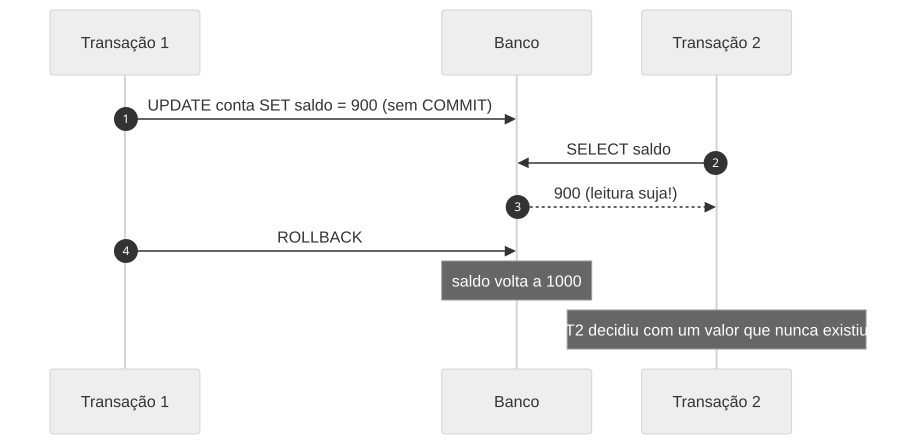
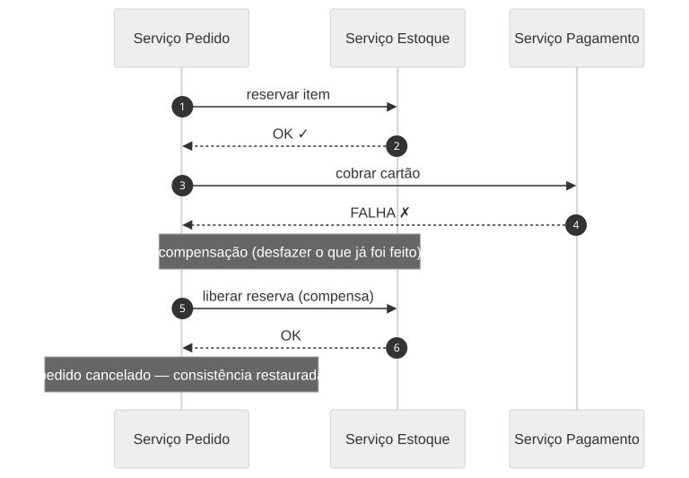

<!-- _class: capa -->
<!-- _paginate: false -->

# Processamento de Transações
## ACID, concorrência, isolamento e além

**Unidade 6** · Banco de Dados · 2026/2
Prof. M.Sc. Howard Cruz Roatti

---

## Nesta aula

- **Transação** — conceito, estados e o arquivo de **LOG**
- **ACID** — atomicidade, consistência, isolamento, durabilidade
- **Concorrência** — anomalias e **níveis de isolamento**
- **Como os SGBDs implementam** — bloqueios × **MVCC / snapshot isolation**
- **Além de um banco** — transações distribuídas e o padrão **SAGA**

---

<!-- _class: secao -->

# Conceitos

---

## O que é uma transação

> **Unidade lógica de processamento** que acessa e possivelmente atualiza vários itens de dados — deve ocorrer **por inteiro ou não ocorrer**.

Exemplo clássico — transferência bancária:

```sql
BEGIN;
  UPDATE conta SET saldo = saldo - 100 WHERE id = 1;   -- débito
  UPDATE conta SET saldo = saldo + 100 WHERE id = 2;   -- crédito
COMMIT;   -- (ou ROLLBACK se algo falhar)
```

<div class="aviso">Se o sistema cair <strong>entre</strong> os dois <code>UPDATE</code>, o dinheiro não pode "sumir". É isso que as transações garantem.</div>

---

## Estados de uma transação



- `COMMIT` torna as alterações **permanentes**; `ROLLBACK` **desfaz** tudo.

---

## O arquivo de LOG

- Arquivo em disco que registra as **imagens antes e depois** de cada alteração (*write-ahead log*, WAL).
- É a base da **recuperação**: permite **refazer** (redo) transações efetivadas e **desfazer** (undo) as não efetivadas após uma falha.
- Garante **Atomicidade** e **Durabilidade** mesmo com queda de energia/sistema.

<div class="dica">💡 "Escreve no log primeiro, no dado depois" — princípio <em>write-ahead</em>. Sem log, não há recuperação confiável.</div>

---

<!-- _class: secao -->

# Propriedades ACID

---

## ACID em uma tela

| | Propriedade | Garante que… |
|---|---|---|
| **A** | Atomicidade | tudo ou nada — via LOG (undo) |
| **C** | Consistência | o BD sai de um estado válido para outro válido |
| **I** | Isolamento | transações concorrentes não interferem entre si |
| **D** | Durabilidade | o que foi efetivado **persiste** — via LOG (redo) |

<div class="dica">Atomicidade e Durabilidade são sustentadas pelo <strong>LOG</strong>; Consistência pelas <strong>constraints + regras</strong>; Isolamento pelo <strong>controle de concorrência</strong>.</div>

---

<!-- _class: secao -->

# Concorrência

---

## Por que executar em paralelo?

- **Vazão (throughput)** e melhor uso de CPU/disco — enquanto uma transação espera I/O, outra progride.
- Mas o acesso concorrente sem controle gera **anomalias**:
  - **Leitura suja** (*dirty read*)
  - **Leitura não repetível** (*non-repeatable read*)
  - **Leitura fantasma** (*phantom read*)
  - **Atualização perdida** (*lost update*)

---

## Anomalia: leitura suja (dirty read)



> Ler um dado que outra transação alterou **mas ainda não confirmou** (e que pode ser desfeito).

---

## Outras anomalias

- **Leitura não repetível:** T1 lê uma linha; T2 **atualiza e commita**; T1 lê de novo e vê **valor diferente**.
- **Leitura fantasma:** T1 lê um conjunto por um critério; T2 **insere/remove** linhas que satisfazem o critério; T1 relê e aparecem/somem **linhas "fantasma"**.
- **Atualização perdida:** duas transações leem o mesmo valor e gravam por cima — uma escrita **se perde**.

---

## Níveis de isolamento (ANSI SQL)

| Nível | Leitura suja | Não repetível | Fantasma |
|---|:---:|:---:|:---:|
| **Read Uncommitted** | ✅ pode | ✅ pode | ✅ pode |
| **Read Committed** | ❌ | ✅ pode | ✅ pode |
| **Repeatable Read** | ❌ | ❌ | ✅ pode* |
| **Serializable** | ❌ | ❌ | ❌ |

<div class="aviso">Trade-off: mais isolamento ⇒ mais consistência, porém <strong>menos concorrência</strong>. *No MySQL/InnoDB, o Repeatable Read evita muitos fantasmas via <em>next-key locks</em>.</div>

---

## Como os SGBDs implementam

- **Bloqueios (locks):** transação "trava" o dado (compartilhado/exclusivo). Simples, mas gera espera e **deadlocks**.
- **MVCC (Multi-Version Concurrency Control):** o SGBD mantém **versões** do dado — **leitores não bloqueiam escritores** e vice-versa. Cada transação enxerga um *snapshot* consistente.

| SGBD | Padrão | Mecanismo |
|---|---|---|
| **Oracle** | Read Committed | MVCC (*undo segments*) |
| **PostgreSQL** | Read Committed | MVCC (tuplas versionadas) |
| **MySQL/InnoDB** | Repeatable Read | MVCC + *next-key locks* |

---

## Deadlock (impasse)

- T1 trava A e espera B; T2 trava B e espera A — **espera circular**.
- O SGBD **detecta** e aborta uma das transações (a "vítima"), que deve ser **repetida**.

<div class="dica">💡 Prevenção prática: acesse recursos <strong>sempre na mesma ordem</strong>, mantenha transações <strong>curtas</strong> e trate o erro de deadlock com <em>retry</em>.</div>

---

<!-- _class: secao -->

# Além de um banco

---

## Transações distribuídas

- Em **microsserviços/nuvem**, uma operação de negócio cruza **vários serviços e bancos**.
- **2PC (Two-Phase Commit)** coordena o commit entre nós, mas **bloqueia recursos** e não escala bem — pouco usado em arquiteturas modernas.
- Alternativa dominante: **consistência eventual** com o padrão **SAGA**.

---

## Padrão SAGA

> Uma sequência de transações **locais**; se um passo falha, executam-se **transações compensatórias** que desfazem os anteriores.



- **Coreografia** (serviços reagem a eventos) ou **orquestração** (um coordenador central). Conecta-se com **Sistemas Distribuídos**.

---

## Boas práticas

- Transações **curtas** e objetivas — segure locks o mínimo possível.
- Escolha o **nível de isolamento** pelo caso de uso (nem sempre Serializable).
- Trate **deadlocks/serialização** com **retry** idempotente.
- Em sistemas distribuídos, projete **compensações** desde o início (SAGA).
- **Meça**: monitore locks, tempo de transação e conflitos.

---

## Bibliografia

- ELMASRI, R.; NAVATHE, S. B. **Sistemas de Banco de Dados.** 7ª ed. São Paulo: Pearson, 2019.
- SILBERSCHATZ, A.; KORTH, H.; SUDARSHAN, S. **Sistema de Banco de Dados.** 7ª ed. Rio de Janeiro: Elsevier, 2020.
- BERNSTEIN, P.; NEWCOMER, E. **Principles of Transaction Processing.** 2nd ed. Morgan Kaufmann, 2009.
- RICHARDSON, C. **Microservices Patterns** (cap. SAGA). Manning, 2018.

---

<!-- _class: secao -->

# Dúvidas?
### howard.cruz@faesa.br


<a class="proximo" href="concorrencia-recuperacao.html">Próximo →<small>Controle de Concorrência e Recuperação</small></a>
