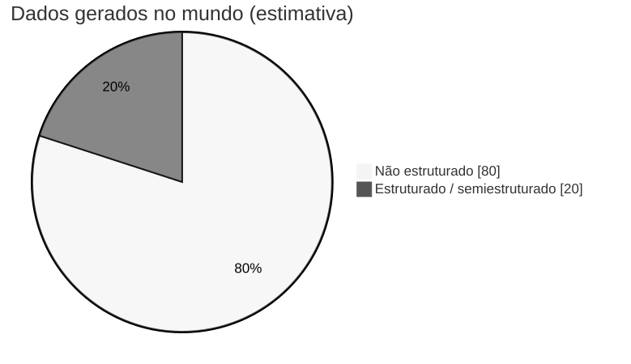

<!-- _class: capa -->
<!-- _paginate: false -->

# Bancos de Dados NoSQL
## Dados não estruturados, famílias e o elo com a IA

**Unidade 7** · Banco de Dados · 2026/2
Prof. M.Sc. Howard Cruz Roatti

---

## Nesta aula

- **Tipos de dado** — estruturado, semiestruturado e não estruturado
- **Por que NoSQL** — escala, agregados (DDD), **CAP** e **BASE**
- **Famílias** — chave-valor, documento, coluna, grafo, **espacial** (e além)
- **NoSQL na nuvem** — serviços gerenciados (DBaaS)
- **NoSQL + IA** — **bancos vetoriais** e **RAG**
- **SQL × NoSQL** — não é "melhor", é **adequação**

---

<!-- _class: secao -->

# Tipos de dado

---

## Estruturado · Semiestruturado · Não estruturado

| Tipo | Estrutura | Exemplos |
|---|---|---|
| **Estruturado** | rígida (tabelas, colunas) | tabelas relacionais, planilhas |
| **Semiestruturado** | flexível, autodescritiva | **JSON**, XML, logs |
| **Não estruturado** | sem esquema definido | texto, e-mail, imagem, áudio, vídeo |

<div class="aviso">📊 Estima-se que a <strong>maior parte</strong> dos dados gerados hoje é <strong>não estruturada</strong> — e cresce mais rápido que a estruturada.</div>

---

## O dilúvio de dados não estruturados



Estima-se que **~80%** dos dados do mundo sejam **não estruturados** (texto, e-mail, mídia) — e é justamente o que os bancos relacionais tradicionais **não** foram feitos para tratar.

---

## Por que os bancos NoSQL surgiram?

- **Volume e velocidade** (Big Data, web em escala) exigiram **escala horizontal** — distribuir em muitos servidores comuns.
- O **modelo relacional** (esquema rígido, JOINs, transações fortes) é difícil de escalar horizontalmente.
- Aplicações web passaram a lidar com dados **flexíveis** e **semiestruturados** (JSON).

> **NoSQL** = "Not Only SQL" — uma **família** de bancos não relacionais, cada um para um tipo de problema.

---

<!-- _class: secao -->

# Fundamentos

---

## Características comuns

- **Escalabilidade horizontal** (*scale-out*): adicionar nós em vez de um servidor maior.
- **Esquema flexível** (*schema-less* ou *schema-on-read*): o dado carrega sua estrutura.
- **Orientação a agregados**: o dado é lido/gravado como uma **unidade** (documento, item) — menos JOINs.
- **Alta disponibilidade** e tolerância a partições de rede.

<div class="dica">💡 "Agregado" = um conjunto de dados tratado como uma unidade — detalhamos no próximo slide.</div>

---

## Orientação a agregados (DDD)

- O usuário quer trabalhar com dados como **unidades ricas** — um registro que **aninha** listas e outras estruturas.
- Essa unidade é o **agregado**, termo do **Domain-Driven Design (DDD)**: *um conjunto de objetos relacionados tratado como uma só unidade*.
- Define a **unidade de manipulação** e de **consistência** do dado — a base de **chave-valor**, **documento** e **família de colunas**.

<div class="dica">💡 Guardar o "pedido + itens" como um agregado evita <code>JOIN</code>s e casa com o jeito que a aplicação usa o dado.</div>

---

## Teorema CAP

Em um sistema **distribuído**, na presença de uma **partição de rede (P)**, escolhe-se entre:

<div class="cols">
<div>

- **C — Consistência**
  todos leem o dado mais recente
- **A — Disponibilidade**
  toda requisição recebe resposta
- **P — Tolerância a Partição**
  funciona mesmo com falha de rede

</div>
<div>

**Não dá para ter C + A + P ao mesmo tempo.**

- Relacionais clássicos → tendem a **CP**
- Muitos NoSQL → tendem a **AP** (consistência *eventual*)

</div>
</div>

<div class="aviso">Consistência <strong>eventual</strong>: após um tempo sem novas escritas, todos os nós convergem para o mesmo valor.</div>

---

## De ACID a BASE

Onde o relacional busca **ACID**, muitos NoSQL adotam **BASE**:

- **B**asically **A**vailable — o sistema **sempre responde** (mesmo que com dado um pouco antigo).
- **S**oft state — o estado **pode mudar** com o tempo, mesmo sem novas escritas (propaga-se entre nós).
- **E**ventual consistency — os nós **convergem** depois; peça-chave é a **resolução de conflitos** quando o dado está em trânsito entre nós.

<div class="dica">💡 ACID prioriza <strong>consistência</strong>; BASE prioriza <strong>disponibilidade e escala</strong> — de novo, é uma escolha por <em>adequação</em>.</div>

---

<!-- _class: secao -->

# Famílias NoSQL

---

## Chave-valor (Key-Value)

- Modelo mais simples: uma **chave** aponta para um **valor** opaco.
- Extremamente rápido; ideal para **cache**, **sessões**, contadores.
- Exemplos: **Redis**, **Amazon DynamoDB**, Riak.

```text
SET sessao:abc123  "{ user: 42, exp: 1699999999 }"
GET sessao:abc123
```

<div class="vm">🖥️ A <strong>VM LabDatabase</strong> tem <strong>Redis</strong> disponível para prática.</div>

---

## Orientado a Documentos

- Armazena **documentos** (JSON/BSON) com estrutura flexível, agrupados em **coleções**.
- Bom para catálogos, perfis, conteúdo — o "agregado" cabe em um documento.
- Exemplos: **MongoDB**, Couchbase, Firestore.

```json
{
  "_id": "P-1001",
  "nome": "Notebook",
  "preco": 3500,
  "tags": ["eletrônicos", "informática"]
}
```

---

## Orientado a Colunas · Grafos

<div class="cols">
<div>

**Colunar (wide-column)**
- Dados por **família de colunas**; ótimo para escrita massiva e séries.
- Escala para petabytes.
- Ex.: **Cassandra**, HBase, ScyllaDB.

</div>
<div>

**Grafos**
- **Nós** e **relacionamentos** como cidadãos de 1ª classe.
- Ideal para redes sociais, recomendação, detecção de fraude.
- Ex.: **Neo4j**, Amazon Neptune.

</div>
</div>

<div class="dica">Ainda há nichos: <strong>séries temporais</strong> (InfluxDB, TimescaleDB), <strong>espaciais</strong> (PostGIS) e <strong>busca</strong> (Elasticsearch).</div>

---

## Bancos de dados espaciais (GIS)

Guardam e consultam **dados geográficos** — você usa todo dia no GPS, em "restaurante mais próximo", em mapas.

- Padronizados pelo **OGC** (*Open Geospatial Consortium*) — o padrão **OpenGIS**.
- Elementos atômicos: **ponto**, **linha** e **polígono**.
- Objetos em **2D**, **2.5D** (2D + elevação → mapeamento **GIS**) e **3D**.
- **Ex.:** um meteorologista modela um furacão (temperatura, vento, umidade) em 3D; **PostGIS** (extensão do PostgreSQL), MongoDB (índices geoespaciais).

---

## NoSQL na nuvem (DBaaS)

- Bancos **gerenciados**: sem instalar/manter servidor — escala, backup e alta disponibilidade automáticos.
- **Amazon DynamoDB**, **Azure Cosmos DB**, **Google Firestore**, **MongoDB Atlas**, **Redis Cloud**.
- Modelo **serverless** e cobrança por uso — comum em projetos modernos e no **free tier**.

<div class="dica">💡 Ótimo para o MVP do Projeto Integrador: subir um banco na nuvem em minutos, sem infraestrutura.</div>

---

<!-- _class: secao -->

# NoSQL + Inteligência Artificial

---

## Bancos vetoriais

- Guardam **embeddings**: vetores numéricos que representam o **significado** de textos, imagens, áudio.
- Permitem **busca por similaridade** (vizinhos mais próximos) — "encontre o parecido", não o "igual".
- Exemplos: **pgvector** (extensão do PostgreSQL), **Chroma**, **Qdrant**, **Pinecone**.

```sql
-- PostgreSQL + pgvector: itens mais próximos de um vetor de consulta
SELECT id, texto
  FROM documentos
 ORDER BY embedding <-> :consulta   -- distância vetorial
 LIMIT 5;
```

---

## RAG — Retrieval-Augmented Generation

O banco vetorial dá **memória e contexto** a um LLM: recupera trechos relevantes e os injeta no prompt.


<div class="dica">💡 É a ponte direta entre <strong>Banco de Dados</strong> e as <strong>aplicações de IA</strong> do Projeto Integrador (GenAI, RAG).</div>

---

## Persistência poliglota

> Usar **o banco certo para cada necessidade** dentro da mesma aplicação.


---

## SQL × NoSQL — adequação, não competição

| Prefira **SQL (relacional)** quando… | Prefira **NoSQL** quando… |
|---|---|
| dados estruturados e estáveis | esquema flexível / evolutivo |
| transações fortes (ACID) | escala horizontal massiva |
| relatórios com muitos JOINs | agregados lidos como unidade |
| consistência imediata | disponibilidade / baixa latência |

<div class="aviso">A resposta madura é quase sempre <strong>“depende do problema”</strong> — e frequentemente <strong>os dois</strong> (persistência poliglota).</div>

---

## Bibliografia

- SADALAGE, P.; FOWLER, M. **NoSQL Distilled** (Um Guia Conciso para o Mundo Emergente da Persistência Poliglota). Novatec, 2013.
- ELMASRI, R.; NAVATHE, S. B. **Sistemas de Banco de Dados.** 7ª ed. Pearson, 2019. (cap. NoSQL/Big Data)
- KLEPPMANN, M. **Designing Data-Intensive Applications.** O'Reilly, 2017.
- Documentação: **MongoDB**, **Redis**, **Amazon DynamoDB**, **pgvector**.

---

<!-- _class: secao -->

# Dúvidas?
### howard.cruz@faesa.br


<a class="proximo" href="mongodb-na-vm.html">Próximo →<small>MongoDB na VM</small></a>
